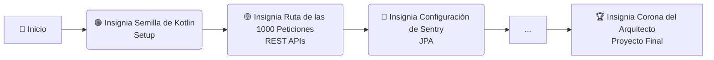

# 🏨 Bienvenido al Hotel Pokémon de Ciudad Paleta

Aquí, cada línea de código te acerca a convertirte en un **Maestro Pokémon de Spring Boot**...

## Logros del viaje (Badges)

| Módulo     | Insignia                                                                                                                                                        | Fecha      | Habilidades desbloqueadas                                                             | Branch                                                                                                           |
|------------|-----------------------------------------------------------------------------------------------------------------------------------------------------------------|------------|---------------------------------------------------------------------------------------|------------------------------------------------------------------------------------------------------------------|
| Capítulo 1 |               | 2025-10-26 | ✅ Configurar Spring Boot + Kotlin: Se configuró el entorno, linter y el proyecto base | [feature/milestone-01-starter](https://github.com/lgzarturo/springboot-course/tree/feature/milestone-01-starter) |
| Capítulo 2 |  | 2025-10-26 | ✅ Crear endpoints y DTOs: Crear endpoint hello world de forma hexagonal               | [v0.0.1 - Semana 0-2](https://github.com/lgzarturo/springboot-course/releases/tag/v0.0.1)                        |
| Capítulo 3 |      | 2025-10-26 | ✅ Manejo de errores: Integración de Sentry, Excepciones personalizadas                | [feature/milestone-01-sentry](https://github.com/lgzarturo/springboot-course/tree/feature/milestone-01-sentry)   |

## 📈 Progreso del viaje (Progress)

- **Nivel**: 3/10 (Insignia Reliquias de las Entidades)
- **Próximo objetivo**: 🟣 Insignia Lucha (Testing)
- **Barra de progreso**:
  [=====-----] 50%

## ⚠️ Team Rocket te advierte: ¡Errores comunes!

- La configuración de Sentry es simple, pero puedes personalizarla con la [documentación oficial](https://docs.sentry.io/platforms/java/guides/spring-boot/configuration/).
- Asegúrate de manejar las excepciones correctamente para evitar capturar errores genéricos.
- No olvides revisar las variables de entorno necesarias para Sentry en [ENV_VARIABLES.md](docs/ENV_VARIABLES.md).

## "Mapa del Viaje" (Roadmap Visual)

El camino del viaje se puede visualizar en el siguiente diagrama:

