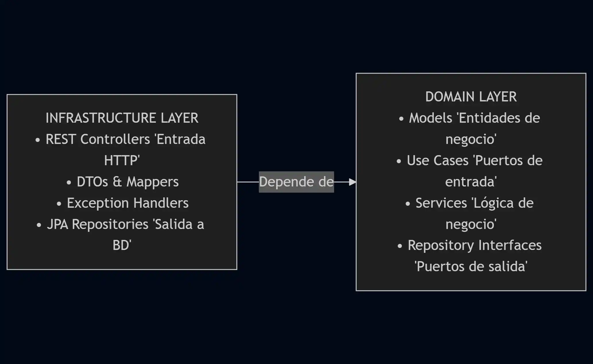

# 🚀 Spring Boot Course—API REST real

[](https://github.com/lgzarturo/springboot-course/releases/tag/v0.0.1)
[](https://spring.io/projects/spring-boot)
[](https://kotlinlang.org/)
[](https://www.oracle.com/java/)
[](LICENSE)
[](https://github.com/lgzarturo/springboot-course/actions)
[](https://github.com/lgzarturo/springboot-course/issues)
[](https://github.com/lgzarturo/springboot-course/pulls)

**Idiomas:** Español

¡Bienvenidas y bienvenidos!

Imagina que eres un desarrollador en una startup de tecnología para hoteles. Tu misión: construir desde cero una plataforma que revolucione la gestión hotelera y el ecommerce de amenities. Pero no estás solo: este curso es tu guía, tus herramientas son Spring Boot y Kotlin, y cada ejercicio es un desafío real que te preparará para el mundo laboral.

Este curso te guiará para construir, paso a paso, una API REST real con Spring Boot 3 y Kotlin. El producto que desarrollaremos se inspira en escenarios del sector de hotelería, ecommerce y ocio, de modo que aprenderás conceptos técnicos mientras enfrentas problemas de negocio reales.

¿Listo para empezar? Aquí no solo aprenderás código: resolverás problemas, optimizarás procesos y crearás soluciones que impacten. ¡Vamos a ello!

> Me gusto la idea de crear un curso basado en código, porque vi un repositorio con una idea similar y me parecio interesante.

---

## 📋 Tabla de Contenidos

- [¿Qué vamos a construir?](#qué-vamos-a-construir)
- [Características](#características)
- [Arquitectura del Proyecto](#arquitectura-del-proyecto)
- [Tecnologías Utilizadas](#tecnologías-utilizadas)
- [Inicio Rápido](#inicio-rápido)
- [Estructura del Proyecto](#estructura-del-proyecto)
- [Endpoints Disponibles](#endpoints-disponibles)
- [Documentación](#documentación)
- [Testing](#testing)
- [Enfoque Didáctico](#enfoque-didáctico-y-metodología)
- [Roadmap](#roadmap)
- [Contribuir](#-contribuir)
- [Licencia](#licencia)
- [Autor](#-autor)
- [Agradecimientos](#-agradecimientos)

---

## ¿Qué vamos a construir?

Este curso es como un mapa del tesoro. Cada módulo es una isla con conocimientos clave, y los ejercicios son cofres que debes abrir para avanzar. Al final, tendrás las habilidades para construir tu propia plataforma hotelera o de ecommerce, lista para escalar.

Desarrollaremos una API REST con capas bien definidas y enfoque de dominio, abordando casos de uso como:

- **Hotelería:** gestión de habitaciones, disponibilidad, reservas y check-in/out.
- **Ecommerce:** catálogo de productos/servicios, carritos/pedidos, pagos y estado de órdenes.
- **Ocio:** ejemplos lúdicos como Pokémon u otras API's públicas para ejemplificar patrones y conceptos.

El objetivo no es solo "hacer que funcione", sino diseñar una base sólida y extensible, con buenas prácticas y foco en las reglas de negocio.

---

## Características

- ✅ **Arquitectura Hexagonal** (Ports & Adapters)
- ✅ **Clean Architecture** y **Domain-Driven Design (DDD)**
- ✅ **Test-Driven Development (TDD)**
- ✅ **Documentación OpenAPI/Swagger**
- ✅ **Monitoreo con Spring Actuator**
- ✅ **Tracking de errores con Sentry**
- ✅ **Validación de datos con Bean Validation**
- ✅ **Manejo global de excepciones**
- ✅ **Cobertura de tests con JaCoCo**
- ✅ **Análisis estático con Detekt**
- ✅ **Formateo de código con KTLint**
- ✅ **CI/CD con GitHub Actions**
- ✅ **Versionado semántico automático**
- ✅ **Conventional Commits**

---

## Arquitectura del Proyecto

Este proyecto implementa una **Arquitectura Hexagonal (Ports & Adapters)** con separación por capas, siguiendo los principios de **Clean Architecture** y **Domain-Driven Design (DDD)**.

> No aseguro que esta arquitectura sea la mejor para todos los casos, simplemente es una buena práctica para proyectos de tamaño mediano a grande.
> Vale la pena revisar las ventajas y desventajas de esta arquitectura.

### Capas Principales



### Ventajas de esta Arquitectura

- ✅ **Independencia de Frameworks**: El dominio no depende de Spring.
- ✅ **Testabilidad**: Fácil de testear cada capa de forma aislada.
- ✅ **Escalabilidad**: Fácil agregar nuevas funcionalidades.
- ✅ **Mantenibilidad**: Código organizado y fácil de encontrar.
- ✅ **Flexibilidad**: Cambiar tecnologías sin afectar la lógica de negocio.

Para más detalles, consulta [ARCHITECTURE.md](docs/ARCHITECTURE.md).

---

## Tecnologías Utilizadas

### Backend
- **Spring Boot 3.5.6** - Framework principal
- **Kotlin 2.0.21** - Lenguaje de programación
- **Spring Data JPA** - Persistencia de datos
- **Spring Validation** - Validación de datos
- **Spring Actuator** - Monitoreo y métricas

### Base de Datos
- **H2 Database** - Base de datos en memoria (desarrollo)
- **PostgreSQL** - Base de datos (producción)

### Documentación
- **SpringDoc OpenAPI 3** - Documentación automática de API
- **Swagger UI** - Interfaz interactiva de documentación

### Testing
- **JUnit 5** - Framework de testing
- **MockK** - Mocking para Kotlin
- **Spring MockMvc** - Testing de controladores
- **JaCoCo** - Cobertura de código

### Calidad de Código
- **Detekt** - Análisis estático de código
- **KTLint** - Formateo y linting de código Kotlin

### Monitoreo y Observabilidad
- **Sentry** - Tracking de errores y monitoreo
- **Spring Boot Actuator** - Métricas y health checks

### DevOps
- **GitHub Actions** - CI/CD
- **Semantic Release** - Versionado automático
- **Conventional Commits** - Estándar de commits

---

## Inicio Rápido

### Prerrequisitos

- **Java 21** o superior
- **Gradle 8.x** (incluido con Gradle Wrapper)
- **Git**
- **IDE** (IntelliJ IDEA recomendado)

### Instalación y Ejecución

1. **Clonar el repositorio**
    ```bash
    git clone https://github.com/lgzarturo/springboot-course.git
    cd springboot-course
    ```

2. **Compilar el proyecto**
    ```bash
    # Linux/Mac
    ./gradlew clean build

    # Windows
    .\gradlew.bat clean build
    ```

3. **Ejecutar la aplicación**
    ```bash
    # Linux/Mac
    ./gradlew bootRun

    # Windows
    .\gradlew.bat bootRun
    ```

4. **Verificar que funciona**
    ```bash
    curl http://localhost:8080/api/v1/ping
    ```

    Respuesta esperada:

    ```json
    {
    "message": "pong",
    "timestamp": "2025-01-25T10:30:00",
    "version": "0.0.1"
    }
    ```

> La aplicación estará disponible en: `http://localhost:8080`

---

## Estructura del Proyecto

```
src/main/kotlin/com/lgzarturo/springbootcourse/
├── SpringbootCourseApplication.kt          # Clase principal
│
├── config/                                 # ⚙️ Configuraciones
│   ├── WebConfig.kt                        # CORS, MVC
│   └── OpenApiConfig.kt                    # Swagger/OpenAPI
│
├── domain/                                 # 🎯 Dominio (Core)
│   ├── model/                              # Modelos de negocio
│   ├── port/
│   │   ├── input/                          # Casos de uso
│   │   └── output/                         # Interfaces de repositorios
│   └── service/                            # Lógica de negocio
│
├── infrastructure/                         # 🔌 Infraestructura
│   ├── rest/                               # Adaptadores REST
│   │   ├── controller/                     # Controladores
│   │   ├── dto/                            # DTOs
│   │   └── mapper/                         # Mappers
│   ├── persistence/                        # Adaptadores de BD
│   │   ├── entity/                         # Entidades JPA
│   │   ├── repository/                     # Repositorios
│   │   └── mapper/                         # Mappers
│   └── exception/                          # Manejo de errores
│
└── shared/                                 # 🔧 Código compartido
    ├── constant/                           # Constantes
    ├── util/                               # Utilidades
    └── extension/                          # Extension functions
```

---

## Endpoints Disponibles

### Ping API (Ejemplo Implementado con TDD)

| Método | Endpoint                 | Descripción                    |
|--------|--------------------------|--------------------------------|
| GET    | `/api/v1/ping`           | Ping simple                    |
| GET    | `/api/v1/ping/{message}` | Ping con mensaje personalizado |
| GET    | `/api/v1/ping/health`    | Health check                   |

### Ejemplos de Uso

```bash
# Ping simple
curl http://localhost:8080/api/v1/ping

# Respuesta:
# {
#   "message": "pong",
#   "timestamp": "2024-01-15T10:30:00",
#   "version": "1.0.0"
# }

# Ping con mensaje
curl http://localhost:8080/api/v1/ping/hello

# Health check
curl http://localhost:8080/api/v1/ping/health
```

### Documentación Interactiva

- **Swagger UI**: http://localhost:8080/swagger-ui.html
- **OpenAPI JSON**: http://localhost:8080/api-docs
- **H2 Console**: http://localhost:8080/h2-console

### Actuator Endpoints

- **Health**: http://localhost:8080/actuator/health
- **Info**: http://localhost:8080/actuator/info
- **Metrics**: http://localhost:8080/actuator/metrics

---

## Documentación

### Documentación del Proyecto

- **[ARCHITECTURE.md](docs/ARCHITECTURE.md)** - Arquitectura detallada del proyecto
- **[ARCHITECTURE_DIAGRAM.md](docs/ARCHITECTURE_DIAGRAM.md)** - Diagramas visuales
- **[DEVELOPMENT_GUIDE.md](docs/DEVELOPMENT_GUIDE.md)** - Guía de desarrollo
- **[IMPLEMENTATION_CHECKLIST.md](docs/IMPLEMENTATION_CHECKLIST.md)** - Checklist de implementación

### Workflow y Versionado

- **[WORKFLOW.md](WORKFLOW.md)** - Flujo de trabajo completo: commits, versionado y releases
- **[COMMIT_GUIDE.md](COMMIT_GUIDE.md)** - Guía de commits convencionales
- **[COMMIT_FIXING_GUIDE.md](COMMIT_FIXING_GUIDE.md)** - Cómo corregir errores en el historial de commits
- **[CHANGELOG.md](CHANGELOG.md)** - Historial de cambios del proyecto

### Seguridad

- **[SECURITY.md](SECURITY.md)** - Política de seguridad, reporte de vulnerabilidades y mejores prácticas

### Contribución

- **[CONTRIBUTING.md](CONTRIBUTING.md)** - Guía para contribuir al proyecto
- **[CODE_OF_CONDUCT.md](CODE_OF_CONDUCT.md)** - Código de conducta

### Archivos HTTP

En el directorio `http/` encontrarás ejemplos de peticiones HTTP que puedes ejecutar directamente desde IntelliJ IDEA:

- **[ping.http](http/ping.http)** - Ejemplos de peticiones al PingController
- **[actuator.http](http/actuator.http)** - Endpoints de Actuator

### Curso y Aprendizaje

- **[Temario del Curso](docs/README.md)** - El principio del viaje ¿Qué puedes aprender?
- **[Prefacio del Autor](AUTHOR.md)** - Historia y motivación del proyecto
- **[FAQ](docs/FAQ.md)** - Preguntas frecuentes

---

## Testing

### Ejecutar Tests

```bash
# Todos los tests
./gradlew test

# Tests con reporte detallado
./gradlew test --info

# Tests de una clase específica
./gradlew test --tests "PingServiceTest"
./gradlew test --tests "PingControllerTest"

# Reporte de cobertura
./gradlew jacocoTestReport
```

### Estrategia de Testing

- **Unit Tests**: Tests del dominio sin Spring (rápidos)
- **Integration Tests**: Tests de controladores con MockMvc
- **E2E Tests**: Tests de flujos completos (futuro)

### Cobertura de Tests

```
✅ PingServiceTest - Tests unitarios del servicio
✅ PingControllerTest - Tests de integración del controller
```

> El reporte de cobertura se genera en: build/reports/jacoco/test/html/index.html

---

## Enfoque didáctico y metodología

- **Aprender haciendo:** cada avance del repositorio añade una pieza del sistema.
- **Desarrollo incremental:** actualizaciones semanales con pequeños incrementos y mejoras continuas.
- **TDD (*Test-Driven Development*):** planificaremos gran parte del desarrollo escribiendo primero las pruebas, usando JUnit y Spring Boot Test para validar comportamientos.
- **Buenas prácticas:** claridad, simplicidad, principios SOLID y orientación a dominio.
- **Más que código:** entender las reglas de negocio y el producto es esencial para crecer profesionalmente.

---

## El repositorio como recurso gratuito

Este repositorio es un recurso abierto para que puedas descargar el código fuente, ejecutarlo localmente y estudiar su evolución. Toda la documentación del proyecto se escribirá dentro del repositorio y se mantendrá junto al código, explicando conceptos y decisiones.

> **Recomendación clave**: revisa el histórico de Git para comprender el proceso de desarrollo. Los commits, ramas y (*cuando corresponda*) tags y releases serán tu mapa de aprendizaje.

---

## Cómo seguir el histórico de desarrollo

- En GitHub: visita la sección de [Commits](https://github.com/lgzarturo/springboot-course/commits/main) para ver los cambios en orden cronológico.
- En tu entorno local:
  - `git pull` para traer actualizaciones semanales.
  - `git log --oneline --graph --decorate` para visualizar el flujo.
  - Revisa los mensajes de commit y las diferencias para entender el “por qué” de cada cambio.

---

## Actualizaciones semanales

Cada semana publicaré incrementos que pueden incluir nuevas funcionalidades, pruebas, refactorizaciones o documentación adicional. La idea es simular un flujo de trabajo real y constante.

### Estructura de Aprendizaje Sugerida

1. Lee este README inicial.
2. Revisa el histórico de commits para ver cómo se construyó la funcionalidad.
3. Corre las pruebas y lee sus casos para entender el comportamiento esperado (TDD).
4. Ejecuta la app, prueba los endpoints y mira los logs.
5. Reflexiona sobre las decisiones de diseño y las reglas de negocio involucradas.


### Objetivo para Perfiles Junior

Este curso busca crear una base de formación sólida: aprenderás a implementar buenas prácticas, entender flujos de trabajo profesionales y, sobre todo, valorar la importancia de las reglas de negocio y el conocimiento del producto para avanzar en tu carrera.

---

## Roadmap

Plan de desarrollo completo: [IMPLEMENTATION_CHECKLIST.md](docs/IMPLEMENTATION_CHECKLIST.md)

### Versión Actual: v0.0.1

- ✅ Configuración inicial del proyecto
- ✅ Arquitectura Hexagonal implementada
- ✅ Ping API con TDD
- ✅ Documentación OpenAPI/Swagger
- ✅ CI/CD con GitHub Actions
- ✅ Versionado semántico automático

> Enlace de la [Versión Estable: v0.0.1](https://github.com/lgzarturo/springboot-course/releases/tag/v0.0.1)

### Próximas Versiones

- 🔄 v0.1.0: Gestión de habitaciones (CRUD completo)
- 🔄 v0.2.0: Sistema de reservas
- 🔄 v0.3.0: Gestión de usuarios y autenticación
- 🔄 v0.4.0: Sistema de pagos
- 🔄 v0.5.0: Catálogo de productos/servicios

Para más detalles, consulta el [CHANGELOG.md](CHANGELOG.md) y los [Issues](https://github.com/lgzarturo/springboot-course/issues).

---

## Documentación dentro del proyecto

- Documentos y guías convivirán con el código (*README.md por carpetas/módulos cuando aporte valor*).
- Se explicarán conceptos, arquitectura y decisiones (*por qué se elige una estrategia sobre otra*).
- Usaremos los recursos de GitHub para un repositorio robusto:
  - Issues para tareas y seguimiento.
  - Projects/Boards para planificación.
  - Discussions (*opcional*) para preguntas y debate.
  - Releases/Tags para hitos.
  - (*Opcional*) GitHub Actions para CI, cuando sea pertinente.

---

## Requisitos

Es importante contar con lo siguiente:

- Conocimientos básicos de Kotlin.
- JDK 21 o superior instalado.
- Git instalado.
- IDE recomendado: IntelliJ IDEA (*Community o Ultimate*).
- No necesitas instalar Gradle: este proyecto incluye Gradle Wrapper.

---

## Puesta en marcha (local)

1) Clona el repositorio
   - `git clone https://github.com/lgzarturo/springboot-course.git`
   - `cd springboot-course`

2) Ejecuta pruebas
   - Windows: `.\gradlew.bat test`
   - macOS/Linux: `./gradlew test`

3) Levanta la aplicación
   - Windows: `.\gradlew.bat bootRun`
   - macOS/Linux: `./gradlew bootRun`

4) Abre en tu IDE y explora el código
   - Archivo principal: `src/main/kotlin/com/lgzarturo/springbootcourse/SpringbootCourseApplication.kt`
   - Configuración: `src/main/resources/application.yml`

---

## Preguntas y soporte

Abre un Issue con tus dudas o propuestas de mejora. Tu retroalimentación ayudará a que el contenido sea cada vez más claro y útil para la comunidad.

- [Sección de preguntas y respuestas](docs/FAQ.md)

---

## El Legado del Desarrollador

Ahora eres parte de una comunidad de desarrolladores que no solo escriben código, sino que resuelven problemas reales. Tu viaje no termina aquí: sigue explorando, contribuye a proyectos open source, y recuerda que cada línea de código que escribes puede mejorar la experiencia de miles de usuarios. ¡El mundo necesita más arquitectos como tú!

- [Prefacio del autor](AUTHOR.md)
- [Temario: El principio del viaje ¿Qué puedes aprender?](docs/README.md)

---

## 🤝 Contribuir

¡Las contribuciones son bienvenidas! Si quieres contribuir:

1. Fork el proyecto
2. Crea una rama para tu feature (`git checkout -b feature/AmazingFeature`)
3. Commit tus cambios siguiendo [Conventional Commits](COMMIT_GUIDE.md) (`git commit -m 'feat: add some AmazingFeature'`)
4. Push de la rama (`git push origin feature/AmazingFeature`)
5. Abre un Pull Request

Por favor, lee [CONTRIBUTING.md](CONTRIBUTING.md) para más detalles sobre nuestro código de conducta y el proceso de envío de pull requests.

---

## Reportar Bugs

Si encuentras un bug, por favor abre un [Issue](https://github.com/lgzarturo/springboot-course/issues/new/choose) con:

- Descripción clara del problema
- Pasos para reproducirlo
- Comportamiento esperado vs. actual
- Screenshots (si aplica)
- Versión del proyecto

---

## Solicitar Features

Para solicitar nuevas características, abre un [Issue](https://github.com/lgzarturo/springboot-course/issues/new/choose) con:

- Descripción de la funcionalidad
- Casos de uso
- Beneficios esperados

---

## Licencia

Este repositorio está licenciado bajo [CC-BY-4.0](LICENSE).

Atribución requerida a: **Arturo López** ([lgzarturo@gmail.com](mailto:lgzarturo@gmail.com))

---

## 👨‍💻 Autor

**Arturo López**

- GitHub: [@lgzarturo](https://github.com/lgzarturo)
- Email: [lgzarturo@gmail.com](mailto:lgzarturo@gmail.com)
- LinkedIn: [Arturo López](https://www.linkedin.com/in/lgzarturo)
- Website: [arthurolg.com](http://arthurolg.com)

---

## 🙏 Agradecimientos

- A la comunidad de Spring Boot
- A todos los que contribuyen con feedback y mejoras
- A los proyectos open source que inspiraron este curso
- A ti, por aprender y crecer con este proyecto

---

## 💬 Soporte y Comunidad

- **Issues:** [GitHub Issues](https://github.com/lgzarturo/springboot-course/issues)
- **Discussions:** [GitHub Discussions](https://github.com/lgzarturo/springboot-course/discussions)
- **FAQ:** [Preguntas Frecuentes](docs/FAQ.md)

---

## 📊 Estado del Proyecto


---

## 🚀 Próximos Pasos

> Plan de desarrollo completo: [IMPLEMENTATION_CHECKLIST.md](docs/IMPLEMENTATION_CHECKLIST.md)

---

**¡Happy Coding! 🚀**

Si este proyecto te ha sido útil, ¡no olvides darle una ⭐ en GitHub!


¡Gracias por tu apoyo y contribución!
