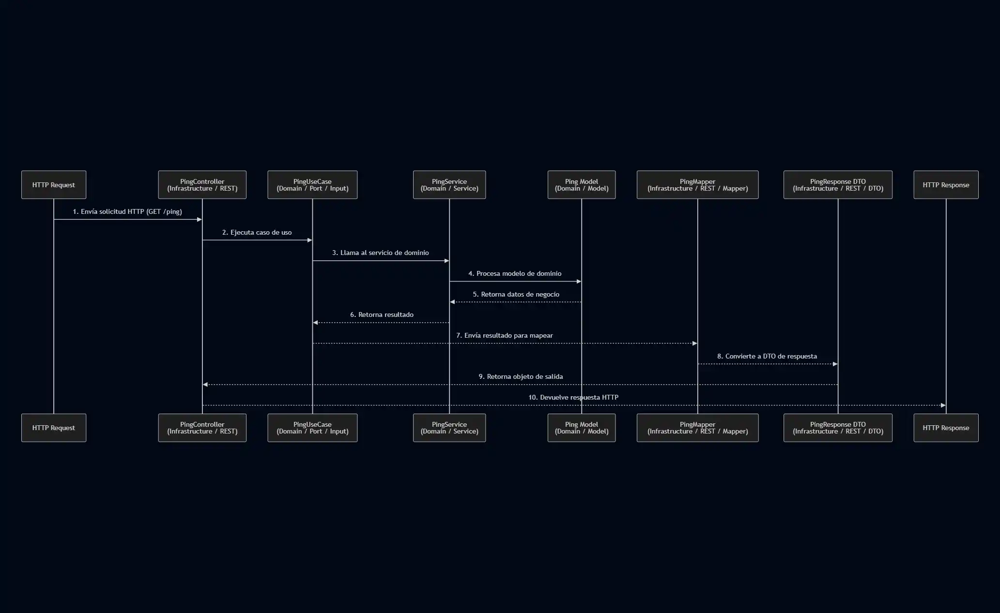

# Estructura del Proyecto - Spring Boot Course

## 📁 Arquitectura del Proyecto

Este proyecto sigue una **arquitectura hexagonal (Ports & Adapters)** simplificada con separación por capas, implementando las mejores prácticas de desarrollo con Spring Boot y Kotlin.

```
src/main/kotlin/com/lgzarturo/springbootcourse/
├── SpringbootCourseApplication.kt          # Clase principal de la aplicación
│
├── config/                                  # ⚙️ Configuraciones de Spring
│   ├── WebConfig.kt                        # Configuración de CORS y MVC
│   └── OpenApiConfig.kt                    # Configuración de Swagger/OpenAPI
│
├── domain/                                  # 🎯 Capa de Dominio (Lógica de Negocio)
│   ├── model/                              # Modelos de dominio (POKOs)
│   │   └── Ping.kt                         # Modelo de dominio Ping
│   ├── service/                            # Servicios de dominio
│   │   └── PingService.kt                  # Implementación de lógica de negocio
│   ├── port/                               # Interfaces (Puertos)
│   │   ├── input/                          # Casos de uso (entrada)
│   │   │   └── PingUseCase.kt             # Contrato del caso de uso
│   │   └── output/                         # Repositorios abstractos (salida)
│   └── exception/                          # Excepciones de dominio
│
├── infrastructure/                          # 🔌 Capa de Infraestructura (Adaptadores)
│   ├── rest/                               # Adaptadores REST (entrada)
│   │   ├── controller/
│   │   │   └── PingController.kt          # Controlador REST
│   │   ├── dto/                            # DTOs de request/response
│   │   │   ├── request/
│   │   │   └── response/
│   │   │       └── PingResponse.kt        # DTO de respuesta
│   │   └── mapper/                         # Mappers entre DTOs y Domain
│   │       └── PingMapper.kt              # Mapper de Ping
│   ├── persistence/                        # Adaptadores de persistencia (salida)
│   │   ├── entity/                         # Entidades JPA
│   │   ├── repository/                     # Repositorios JPA
│   │   └── mapper/                         # Mappers entre Entities y Domain
│   └── exception/                          # Manejo global de excepciones
│       ├── GlobalExceptionHandler.kt       # Manejador global de errores
│       └── ErrorResponse.kt                # DTO de respuesta de error
│
└── shared/                                  # 🔧 Código Compartido
    ├── constant/                           # Constantes de la aplicación
    │   └── AppConstants.kt                 # Constantes globales
    ├── util/                               # Utilidades
    └── extension/                          # Extension functions de Kotlin
        └── DateTimeExtensions.kt           # Extensiones para fechas
```

## 🏗️ Principios de Arquitectura

### 1. **Arquitectura Hexagonal (Ports & Adapters)**
- **Dominio**: Contiene la lógica de negocio pura, independiente de frameworks
- **Puertos**: Interfaces que definen contratos (input/output)
- **Adaptadores**: Implementaciones concretas (REST, JPA, etc.)

### 2. **Separación de Responsabilidades**
- Cada capa tiene una responsabilidad única y bien definida
- El dominio no depende de la infraestructura
- Los adaptadores dependen del dominio, no al revés

### 3. **Inversión de Dependencias**
- Las dependencias apuntan hacia el dominio
- Se usan interfaces (puertos) para desacoplar capas

## 📦 Capas del Proyecto

### **Domain Layer** (Capa de Dominio)
**Responsabilidad**: Contiene la lógica de negocio pura

- **model/**: Modelos de dominio (POKOs - Plain Old Kotlin Objects)
- **service/**: Implementación de la lógica de negocio
- **port/input/**: Casos de uso (interfaces que definen qué se puede hacer)
- **port/output/**: Contratos de salida (interfaces de repositorios)
- **exception/**: Excepciones específicas del dominio

**Características**:
- ✅ Independiente de frameworks
- ✅ Fácil de testear
- ✅ Contiene las reglas de negocio

### **Infrastructure Layer** (Capa de Infraestructura)
**Responsabilidad**: Adaptadores que conectan el dominio con el mundo exterior

#### **rest/** - Adaptadores de entrada HTTP
- **controller/**: Controladores REST (Spring MVC)
- **dto/**: Data Transfer Objects para request/response
- **mapper/**: Conversión entre DTO y modelos de dominio

#### **persistence/** - Adaptadores de salida a base de datos
- **entity/**: Entidades JPA
- **repository/**: Repositorios Spring Data JPA
- **mapper/**: Conversión entre entidades JPA y modelos de dominio

#### **exception/** - Manejo de errores
- Manejo global de excepciones
- Respuestas de error estandarizadas

### **Config Layer** (Capa de Configuración)
**Responsabilidad**: Configuraciones de Spring Boot

- Configuración de CORS
- Configuración de OpenAPI/Swagger
- Configuración de seguridad (futuro)
- Configuración de base de datos (futuro)

### **Shared Layer** (Capa Compartida)
**Responsabilidad**: Código reutilizable en toda la aplicación

- **constant/**: Constantes globales
- **util/**: Utilidades y helpers
- **extension/**: Extension functions de Kotlin

## 🎯 Ventajas de esta Arquitectura

### 1. **Testabilidad**
```kotlin
// Test unitario del dominio (sin Spring)
class PingServiceTest {
    private val pingService = PingService()
    
    @Test
    fun `should return pong`() {
        val result = pingService.getPing()
        assertEquals("pong", result.message)
    }
}
```

### 2. **Independencia del Framework**
El dominio no conoce Spring, puede ser usado en cualquier contexto:
```kotlin
// Modelo de dominio puro
data class Ping(
    val message: String,
    val timestamp: LocalDateTime
)
```

### 3. **Escalabilidad**
Fácil agregar nuevos adaptadores sin modificar el dominio:
- REST Controller → GraphQL Controller
- JPA Repository → MongoDB Repository
- Sin cambios en el dominio

### 4. **Mantenibilidad**
- Código organizado y fácil de encontrar
- Responsabilidades claras
- Bajo acoplamiento

### 5. **Flexibilidad**
- Cambiar tecnologías sin afectar la lógica de negocio
- Múltiples adaptadores para el mismo puerto

## 🔄 Flujo de una Petición



## 📚 Mejores Prácticas Implementadas

### 1. **Naming Conventions**
- **Controllers**: `*Controller.kt`
- **Services**: `*Service.kt`
- **Use Cases**: `*UseCase.kt`
- **DTOs**: `*Request.kt`, `*Response.kt`
- **Mappers**: `*Mapper.kt`
- **Entities**: Sin sufijo (ej: `User.kt`)

### 2. **Package Organization**
- Por capas (domain, infrastructure, config, shared)
- Por funcionalidad dentro de cada capa
- Nombres descriptivos y consistentes

### 3. **Dependency Injection**
```kotlin
@RestController
class PingController(
    private val pingUseCase: PingUseCase,  // Inyección por constructor
    private val pingMapper: PingMapper
)
```

### 4. **DTOs vs Domain Models**
- **DTOs**: Para comunicación externa (API)
- **Domain Models**: Para lógica de negocio interna
- **Mappers**: Para conversión entre ambos

### 5. **Exception Handling**
```kotlin
@RestControllerAdvice
class GlobalExceptionHandler {
    @ExceptionHandler(Exception::class)
    fun handleException(ex: Exception): ResponseEntity<ErrorResponse>
}
```

### 6. **Documentation**
- OpenAPI/Swagger para documentación de API
- KDoc para documentación de código
- README para documentación de arquitectura

### 7. **Testing Strategy**
- **Unit Tests**: Para servicios de dominio (sin Spring)
- **Integration Tests**: Para controladores (con MockMvc)
- **E2E Tests**: Para flujos completos (futuro)

## 🚀 Endpoints Disponibles

### Ping API
- `GET /api/v1/ping` - Ping simple
- `GET /api/v1/ping/{message}` - Ping con mensaje personalizado
- `GET /api/v1/ping/health` - Health check

### Documentación
- `GET /swagger-ui.html` - Interfaz de Swagger UI
- `GET /api-docs` - Especificación OpenAPI JSON

### Actuator
- `GET /actuator/health` - Estado de salud
- `GET /actuator/info` - Información de la aplicación
- `GET /actuator/metrics` - Métricas

## 🛠️ Tecnologías Utilizadas

- **Spring Boot 3.5.6**: Framework principal
- **Kotlin 1.9.25**: Lenguaje de programación
- **Spring Data JPA**: Persistencia de datos
- **H2 Database**: Base de datos en memoria (desarrollo)
- **PostgreSQL**: Base de datos (producción)
- **SpringDoc OpenAPI**: Documentación de API
- **MockK**: Testing con mocks
- **JUnit 5**: Framework de testing

## 📖 Referencias

- [Clean Architecture - Robert C. Martin](https://blog.cleancoder.com/uncle-bob/2012/08/13/the-clean-architecture.html)
- [Hexagonal Architecture - Alistair Cockburn](https://alistair.cockburn.us/hexagonal-architecture/)
- [Spring Boot Best Practices](https://spring.io/guides)
- [Kotlin Coding Conventions](https://kotlinlang.org/docs/coding-conventions.html)

## 🎓 Próximos Pasos

1. Implementar autenticación y autorización (Spring Security)
2. Agregar más entidades y casos de uso
3. Implementar paginación y filtrado
4. Agregar caché (Redis)
5. Implementar eventos de dominio
6. Agregar tests E2E
7. Configurar CI/CD
8. Dockerizar la aplicación

---

**Autor**: Arturo López  
**Versión**: 1.0.0  
**Licencia**: MIT
