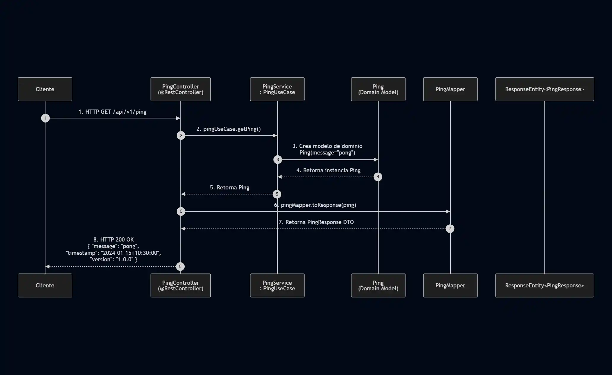
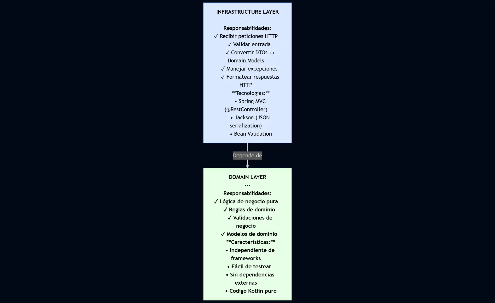
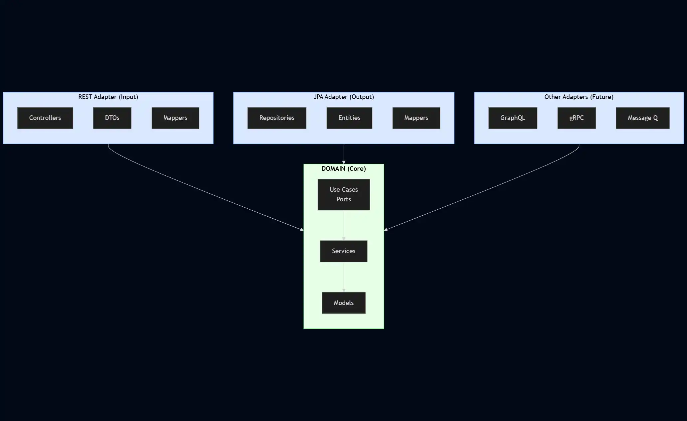
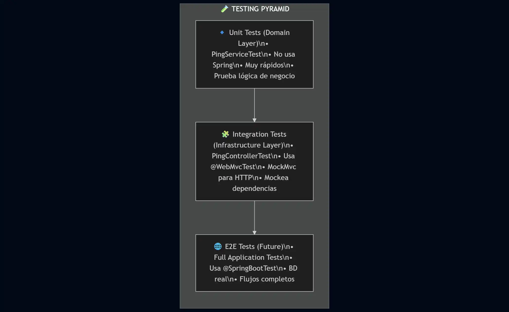
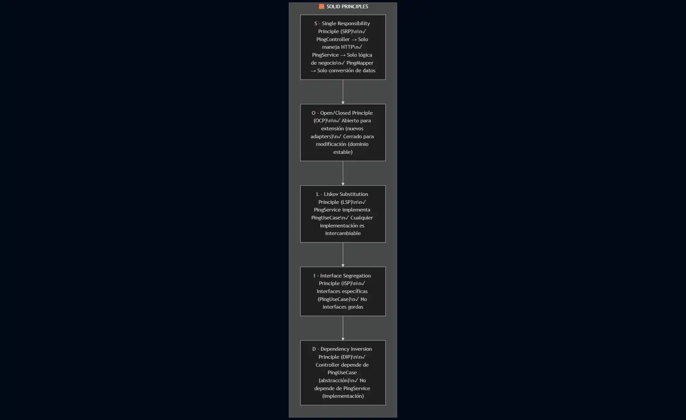

# Diagrama de Arquitectura - Spring Boot Course

## 🏗️ Vista General de la Arquitectura


## 🔄 Flujo de una Petición HTTP
   


## 🎯 Separación de Responsabilidades



## 🔌 Patrón Ports & Adapters



## 📦 Organización de Paquetes

```
com.lgzarturo.springbootcourse
│
├── 📱 SpringbootCourseApplication.kt
│
├── ⚙️ config/
│   ├── WebConfig.kt
│   └── OpenApiConfig.kt
│
├── 🎯 domain/                          ← CORE (Sin dependencias externas)
│   ├── model/
│   │   └── Ping.kt
│   ├── port/
│   │   ├── input/
│   │   │   └── PingUseCase.kt
│   │   └── output/
│   │       └── (Future repositories)
│   └── service/
│       └── PingService.kt
│
├── 🔌 infrastructure/                  ← ADAPTERS (Depende del dominio)
│   ├── rest/
│   │   ├── controller/
│   │   │   └── PingController.kt
│   │   ├── dto/
│   │   │   ├── request/
│   │   │   └── response/
│   │   │       └── PingResponse.kt
│   │   └── mapper/
│   │       └── PingMapper.kt
│   ├── persistence/
│   │   ├── entity/
│   │   ├── repository/
│   │   └── mapper/
│   └── exception/
│       ├── ErrorResponse.kt
│       └── GlobalExceptionHandler.kt
│
└── 🔧 shared/                          ← UTILITIES (Usado por todos)
    ├── constant/
    │   └── AppConstants.kt
    ├── util/
    └── extension/
        └── DateTimeExtensions.kt
```

## 🧪 Estrategia de Testing



## 🔐 Principios de Diseño



## 🚀 Escalabilidad

```
Agregar nuevo módulo (Ejemplo: Users):

1. Domain Layer:
   ├── domain/model/User.kt
   ├── domain/port/input/UserUseCase.kt
   ├── domain/port/output/UserRepository.kt
   └── domain/service/UserService.kt

2. Infrastructure Layer:
   ├── infrastructure/rest/controller/UserController.kt
   ├── infrastructure/rest/dto/request/CreateUserRequest.kt
   ├── infrastructure/rest/dto/response/UserResponse.kt
   ├── infrastructure/rest/mapper/UserMapper.kt
   ├── infrastructure/persistence/entity/UserEntity.kt
   ├── infrastructure/persistence/repository/JpaUserRepository.kt
   └── infrastructure/persistence/adapter/UserRepositoryAdapter.kt

3. Tests:
   ├── test/.../domain/service/UserServiceTest.kt
   └── test/.../infrastructure/rest/controller/UserControllerTest.kt

✓ Sin modificar código existente
✓ Siguiendo el mismo patrón
✓ Manteniendo la separación de capas
```

---

**Leyenda de Símbolos:**
- 📱 Aplicación principal
- ⚙️ Configuración
- 🎯 Dominio (Core)
- 🔌 Infraestructura (Adapters)
- 🔧 Compartido (Utilities)
- ✓ Implementado
- ← Dirección de dependencia
- ▼ Flujo de ejecución
