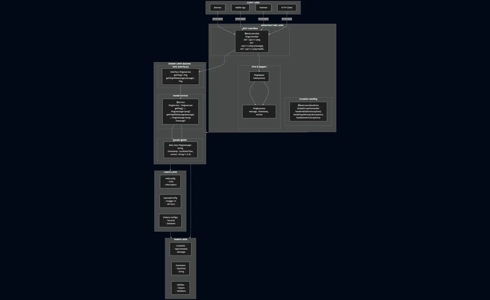
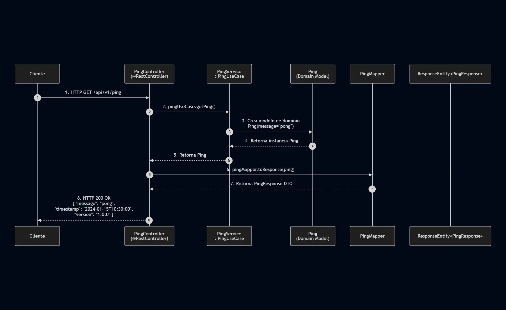
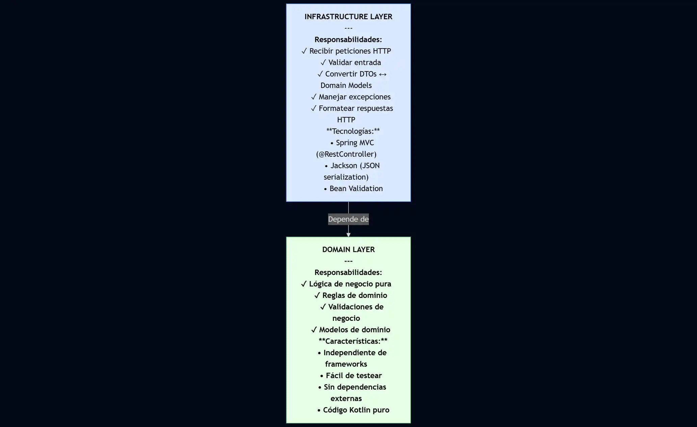
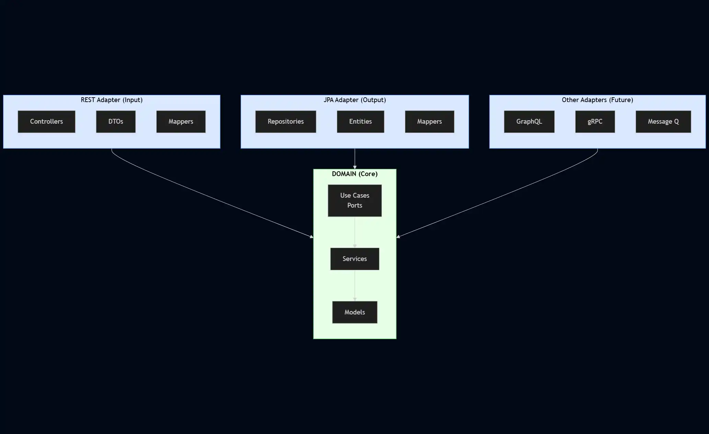
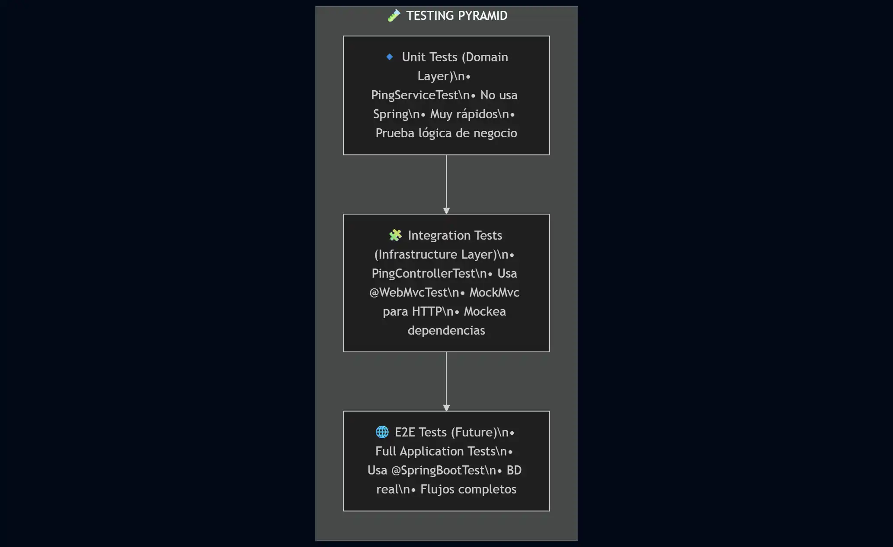
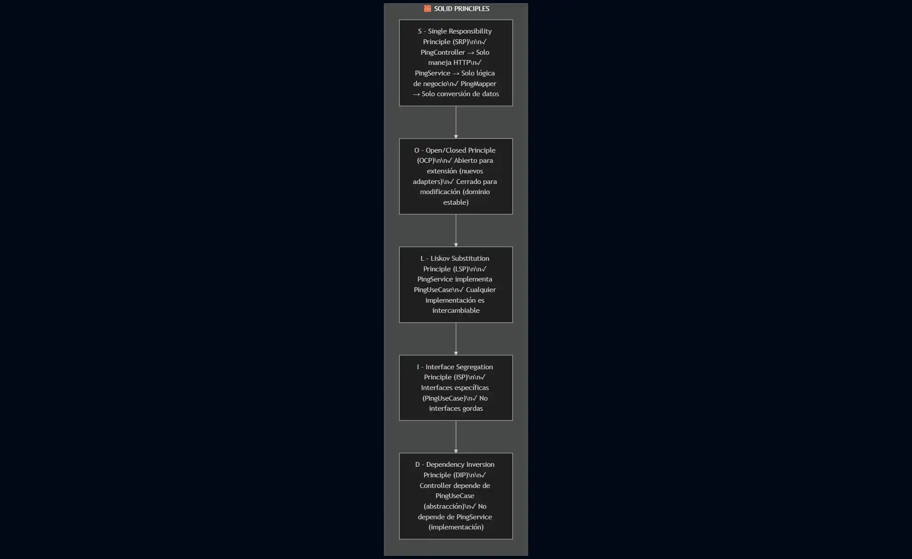

# Diagrama de Arquitectura - Spring Boot Course

> **⚠️ DEPRECATED:** Este documento describe la arquitectura hexagonal original.
> El proyecto ha migrado a **MVC por Features (Screaming Architecture)**.
> Ver: [Plan de Migración: Hexagonal → MVC por Features](architecture/mvc-migration-plan.md)

## 🏗️ Vista General de la Arquitectura



## 🔄 Flujo de una Petición HTTP



## 🎯 Separación de Responsabilidades



## 🔌 Patrón Ports & Adapters



## 📦 Organización de Paquetes (Actual - MVC por Features)

```
com.lgzarturo.springbootcourse
│
├── 📱 SpringbootCourseApplication.kt
│
├── ⚙️ config/                          ← Infraestructura transversal
│   ├── WebConfig.kt
│   └── OpenApiConfig.kt
│
├── 🔧 common/                          ← Componentes reutilizables
│   ├── exception/
│   │   ├── ErrorResponse.kt
│   │   └── GlobalExceptionHandler.kt
│   ├── pagination/
│   │   ├── PageRequest.kt
│   │   └── PageResult.kt
│   ├── constants/
│   │   └── AppConstants.kt
│   └── extensions/
│       └── DateTimeExtensions.kt
│
└── 🎯 features/                       ← Features autocontenidas
    ├── hotels/
    │   ├── HotelController.kt         ← @RestController
    │   ├── HotelService.kt           ← @Service
    │   ├── HotelRepository.kt        ← @Repository
    │   ├── HotelJpaRepository.kt     ← Spring Data JPA
    │   ├── HotelEntity.kt            ← @Entity
    │   ├── Hotel.kt                 ← Dominio puro
    │   └── dto/
    │       ├── CreateHotelRequest.kt
    │       └── HotelResponse.kt
    │
    ├── ping/
    │   ├── PingController.kt
    │   ├── PingService.kt
    │   ├── Ping.kt
    │   └── dto/
    │       └── PingResponse.kt
    │
    ├── users/
    │   ├── UserController.kt
    │   ├── UserService.kt
    │   ├── UserRepository.kt
    │   ├── User.kt
    │   ├── valueobjects/
    │   │   ├── Email.kt
    │   │   └── UserId.kt
    │   └── dto/
    │       └── UserResponse.kt
    │
    └── examples/                     ← Feature de referencia
        └── (...)
```

## 🧪 Estrategia de Testing



## 🔐 Principios de Diseño



## 🚀 Escalabilidad

```
Agregar nuevo módulo (Ejemplo: Users):

1. Domain Layer:
   ├── domain/model/User.kt
   ├── domain/port/input/UserUseCase.kt
   ├── domain/port/output/UserRepository.kt
   └── domain/service/UserService.kt

2. Infrastructure Layer:
   ├── infrastructure/rest/controller/UserController.kt
   ├── infrastructure/rest/dto/request/CreateUserRequest.kt
   ├── infrastructure/rest/dto/response/UserResponse.kt
   ├── infrastructure/rest/mapper/UserMapper.kt
   ├── infrastructure/persistence/entity/UserEntity.kt
   ├── infrastructure/persistence/repository/JpaUserRepository.kt
   └── infrastructure/persistence/adapter/UserRepositoryAdapter.kt

3. Tests:
   ├── test/.../domain/service/UserServiceTest.kt
   └── test/.../infrastructure/rest/controller/UserControllerTest.kt

✓ Sin modificar código existente
✓ Siguiendo el mismo patrón
✓ Manteniendo la separación de capas
```

---

**Leyenda de Símbolos:**

- 📱 Aplicación principal
- ⚙️ Configuración
- 🎯 Dominio (Core)
- 🔌 Infraestructura (Adapters)
- 🔧 Compartido (Utilities)
- ✓ Implementado
- ← Dirección de dependencia
- ▼ Flujo de ejecución
