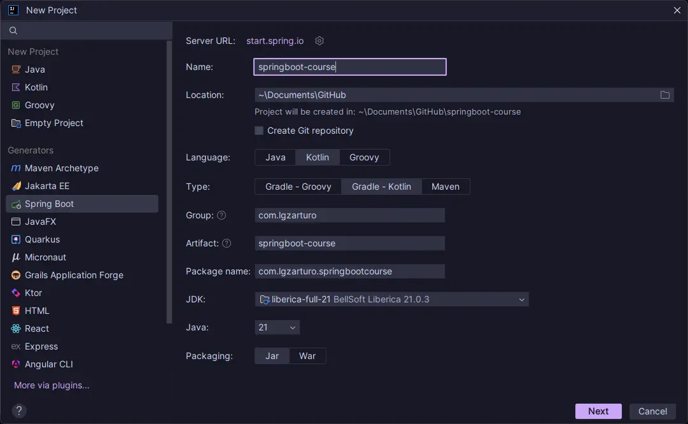
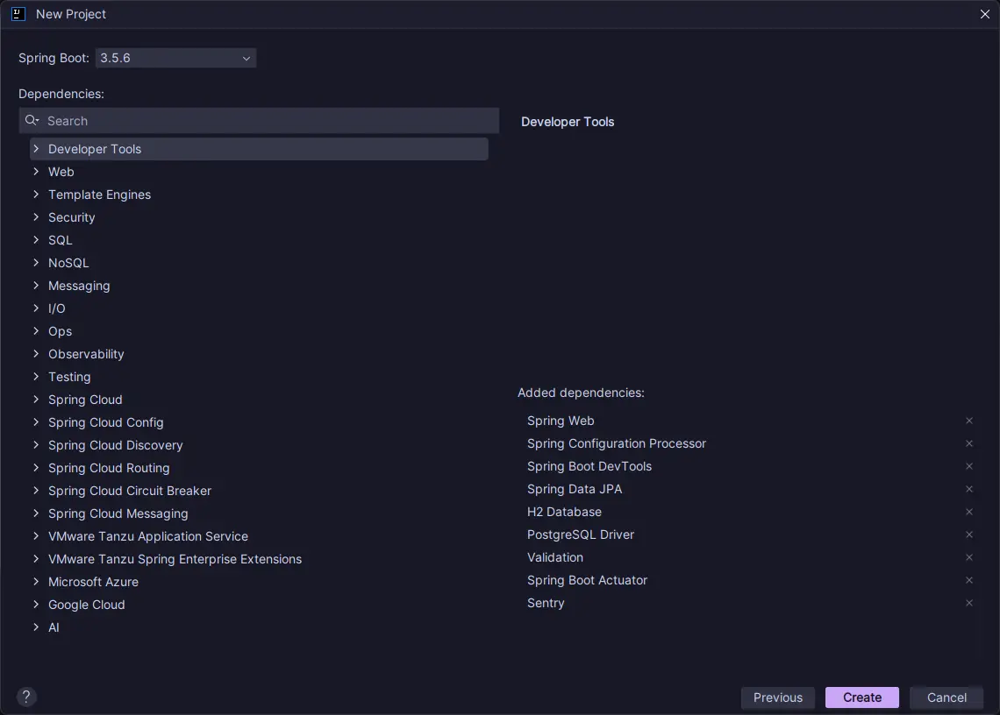
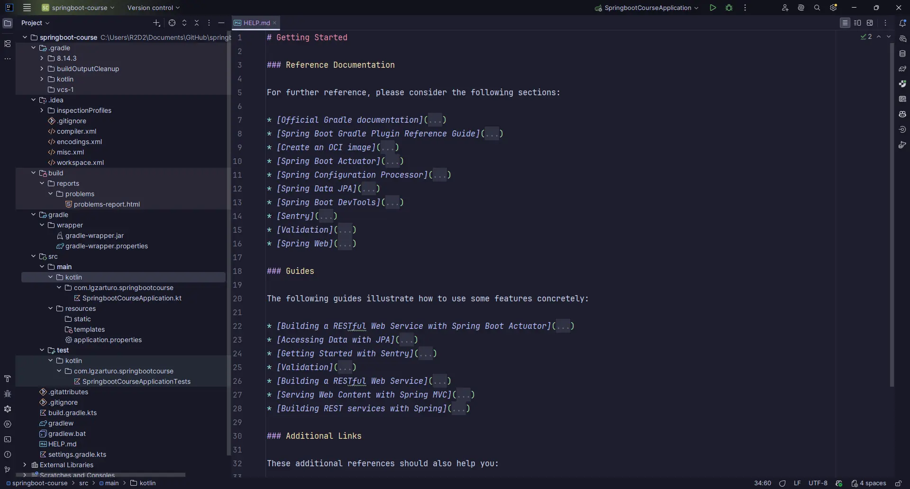
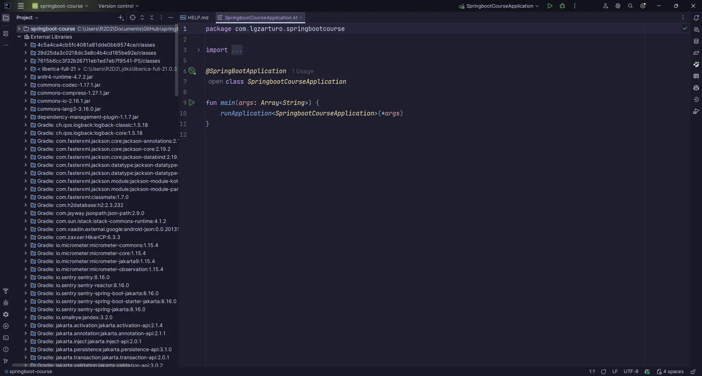
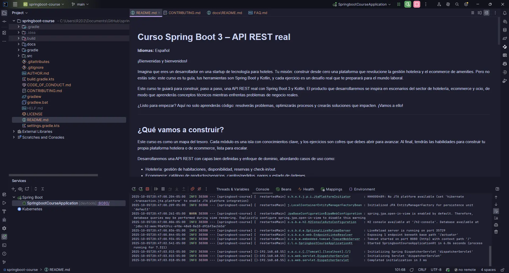

# Bienvenida al curso y calendario de seguimiento

Este es el punto de partida del curso. Aquí encontrarás la bienvenida, el calendario de seguimiento basado en el temario y el primer ejercicio práctico: crear el proyecto inicial.

- **Naturaleza del curso:** vivo, incremental y guiado por buenas prácticas (*TDD cuando sea posible*).
- **Recomendación:** revisa con frecuencia el histórico de Git para entender el proceso y las decisiones.

> Este repositorio es un recurso vivo que acaba de iniciar su desarrollo y evolucionará de forma incremental con foco en la creación de un microservicio API REST con Spring Boot 3 y Kotlin.

---

## Calendario de seguimiento (tentativo)

Basado en el [Temario](../README.md), se propone un calendario orientativo por semanas. Los tiempos pueden ajustarse según tu ritmo.

- Semana 0: Bienvenida, instalación y entorno (*JDK 21, IntelliJ IDEA, Git, Gradle Wrapper*).
  - [Crear el proyecto base con Spring Initializr (Kotlin, Gradle, Boot 3.5.x)](00-first-run/dependencias.md).
- Semana 1: Introducción y configuración inicial del proyecto.
- Semana 2: Conceptos básicos de Spring Boot (*controladores REST, configuración, propiedades*).
- Semana 3: Persistencia con Spring Data JPA (*H2/PostgreSQL, entidades y repositorios*).
- Semana 4: Validación y manejo de errores (Jakarta Validation, ControllerAdvice).
- Semana 5: Seguridad con Spring Security (*JWT básico, roles y protección de endpoints*).
- Semana 6: Pruebas (*JUnit 5, Spring Boot Test, pruebas de integración y controladores*).
- Semana 7: Documentación de API (*OpenAPI/Swagger con SpringDoc*).
- Semana 8: Despliegue |y monitoreo (*Actuator, empaquetado y despliegue; a definir*).
- Semana 9: Temas avanzados (*eventos, async, mensajería, caching*).
- Semanas 10–12: Proyecto final de gestión hotelera (*integración de todo lo visto*).

> Este plan es referencial. El repositorio tendrá incrementos semanales y puedes adaptar el calendario a tus necesidades.

---

## Primer ejercicio: crear el proyecto (paso a paso)

La creación del proyecto es nuestro "Hello World". Sigamos cinco pasos apoyados con imágenes de referencia.

### 1) Configuración del proyecto en IntelliJ IDEA

1. Abre IntelliJ IDEA → New Project → Spring Initializr.
2. Selecciona:
   - Language: Kotlin (*ideal para concisión y nulabilidad segura*)
   - Build system: Gradle (*Kotlin DSL*)
   - Spring Boot: 3.x (*recomendado 3.5.x*)
   - JDK: 21
3. Metadata sugerida:
   - Group: com.lgzarturo
   - Artifact/Name: springboot-course
   - Package Name: com.lgzarturo.springbootcourse (*paquete base donde vivirá la aplicación*).
   - JDK: 21 (*LTS, recomendado por Spring Boot 3.5*).
   - Packaging: Jar.
4. Ubicación del proyecto: elige una carpeta de trabajo.



> **Por qué importa:** dejar desde el inicio el lenguaje, la versión de Boot y el JDK correctos evita fricciones posteriores e incompatibilidades.

**Buenas prácticas de diseño:**

- Definir un package base claro: ayuda a que el escaneo de componentes de Spring (`@ComponentScan`) sea coherente.
- Mantener nombre de artifact y package alineados al dominio del negocio o del curso. Esto facilita modularidad futura si luego extraes módulos.
- **Resultado esperado:** IntelliJ genera el esqueleto del proyecto con el wrapper de Gradle y un archivo principal Kotlin con la clase de arranque.

---

### 2) Dependencias base recomendadas

En el asistente se agregan dependencias clave para una API REST robusta y lista para producción. Más abajo encontrarás la descripción técnica de cada una y por qué conviene incluirlas:

- **Spring Web:** para exponer endpoints REST.
- **Spring Configuration Processor:** autocompletado de propiedades.
- **Spring Boot DevTools:** recarga rápida en desarrollo.
- **Spring Data JPA:** persistencia con JPA/Hibernate.
- **H2 Database:** base en memoria para desarrollo/pruebas.
- **PostgreSQL Driver:** opción recomendada para entornos reales.
- **Validation:** validación de entrada con Jakarta Validation.
- **Spring Boot Actuator:** observabilidad y endpoints de salud/métricas.
- **Sentry:** error tracking y monitoreo de excepciones.



**Notas:**

- En este repositorio ya verás estas dependencias (*y algunas adicionales como Sentry*) en `build.gradle.kts`.
- En Kotlin no necesitas Lombok; usa data classes y características del lenguaje.

**Sugerencia arquitectónica:**

- Piensa en una arquitectura por capas (*Presentation/Controller, Application/Service, Domain, Infrastructure*).
- Las dependencias Web y Validation sirven a la capa de presentación.
- JPA/Drivers a infraestructura.
- Actuator/Observabilidad al runtime
- DevTools y Sentry al developer experience.

---

### 3) Cargar el proyecto en IntelliJ por primera vez

Al finalizar el asistente, IntelliJ creará la estructura básica y abrirá el proyecto. Verás que Gradle comienza a sincronizar.



**Revisa:**

- Que el JDK del proyecto sea 21 (File → Project Structure → SDK).
- Que el plugin de Kotlin esté actualizado.
- Que la estructura estándar esté presente:
  - src/main/kotlin: código de producción.
  - src/main/resources: configuración y recursos.
  - src/test/kotlin: pruebas.
- Archivo de arranque: SpringbootCourseApplication.kt con la anotación `@SpringBootApplication`.
- [HELP.md](../../HELP.md) inicial con enlaces a documentación relevante.

> **Buenas prácticas:** Añade `application.yaml` desde el inicio con perfiles: `default`, `dev`, `prod`. Esto facilita separar la configuración de H2 (`dev`) y PostgreSQL (`local/prod`).

---

### 4) Indexación y descarga de dependencias

IntelliJ indexará los archivos y Gradle descargará dependencias. Espera a que la sincronización termine.



**Clase principal:**

- `@SpringBootApplication` habilita autoconfiguración, escaneo de componentes y configuración adicional.

    ```kotlin
    fun main(args: Array) { runApplication(*args) }
    ```

- Con Kotlin, preferir data classes para entidades DTO y domain objects, y funciones de extensión para utilidades transversales.

**Consejos:**

- Si estás detrás de un proxy, configura Gradle/IDE para permitir la descarga.
- Verifica el archivo `build.gradle.kts` y él `settings.gradle.kts` para asegurar las versiones.
- En caso de errores, usa el panel de Gradle para ejecutar `clean` y `build`.

**Patrones recomendados:**

- DTO's para requests/responses en la capa web.
- Domain Entities ricas en la capa de dominio.
- Repositorios (*Spring Data*) como puertos de salida; Servicios de dominio como puertos de entrada (*inspirado en Hexagonal/Ports and Adapters*).
- Validación con Bean Validation en DTO's; reglas de negocio en dominio.

---

### 5) Primera ejecución del proyecto

Ejecuta la aplicación desde la clase principal o con Gradle Wrapper.

- Clase principal: `src/main/kotlin/com/lgzarturo/springbootcourse/SpringbootCourseApplication.kt`
- Configuración: `src/main/resources/application.yml`
- Comandos:
  - Windows: `./gradlew.bat bootRun`
  - macOS/Linux: `./gradlew bootRun`



**Qué validar:**

- La app inicia sin errores en el puerto 8080.
- Se observa Actuator exponiendo el endpoint base y logs de inicialización (*Hibernate/JPA, H2 console habilitada, DispatcherServlet*).
- Si añadiste Actuator, prueba `http://localhost:8080/actuator/health`.
- **Observa los logs de arranque:** perfil activo, mapeo de endpoints, versión de Boot.
- **DevTools activa LiveReload:** recarga rápida durante el desarrollo.

**Buenas prácticas de verificación:**

- `GET http://localhost:8080/actuator/health` debe devolver `{ "status": "UP" }`.
  - Revisar el cliente HTTP integrado de IntelliJ ([actuator.http](../../http/actuator.http)).
- Con H2 console habilitada, revisar [http://localhost:8080/h2-console](http://localhost:8080/h2-console) en ambiente dev (*y nunca en prod*).
- **Ejercicio:** Agregar un controller mínimo "/ping" para confirmar pipeline de request, response.

> **Hasta aquí ya has logrado mucho:** tener el entorno listo, el proyecto esqueleto corriendo y las dependencias base configuradas. A partir de este punto comenzaremos a construir nuestra API de forma incremental y con prácticas de calidad.

---

## Recursos y siguientes pasos

- Lee el [README principal](../../README.md) para el contexto general del curso.
- Revisa el [Temario](../README.md) y el histórico de commits para seguir la evolución.
- Si surge una duda o propuesta, abre un Issue en el repositorio.
