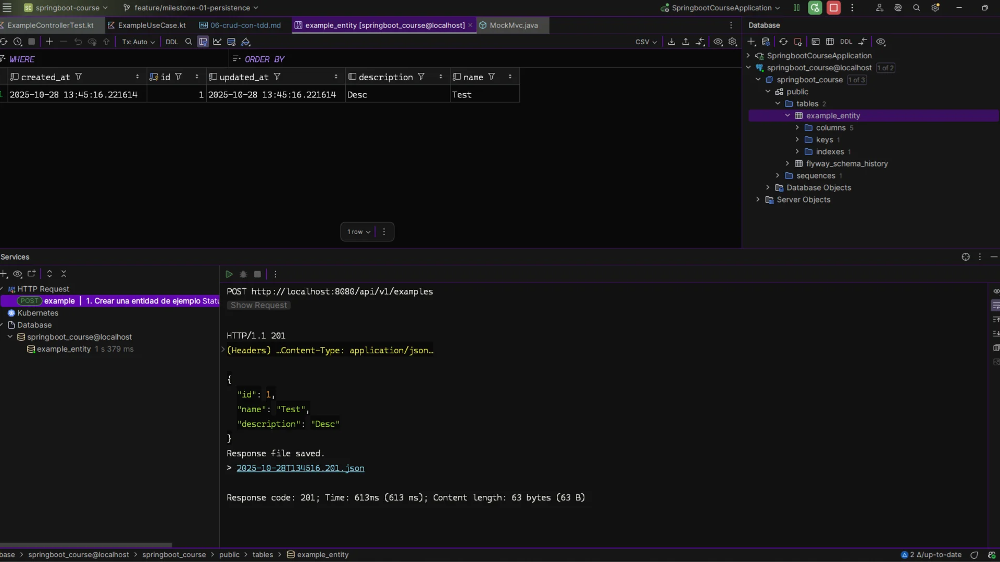

# CRUD con TDD

## 1. Estructura esperada para el CRUD con TDD

El flujo natural del CRUD bajo la arquitectura hexagonal debe ser iterativo y verificable en cada capa. Esta es la estructura objetivo y los archivos reales del repositorio que usaremos en el proceso:

```plaintext
src/main/kotlin/com/lgzarturo/springbootcourse/
└─ domain/
   ├─ model/
   │   └─ Example.kt                                ← Modelo de dominio (no JPA)
   ├─ port/
   │   ├─ input/
   │   │   └─ ExampleUseCase.kt                     ← Interfaces de entrada (casos de uso)
   │   └─ output/
   │       └─ ExampleRepositoryPort.kt              ← Interfaces de salida (persistencia)
   └─ service/
       └─ ExampleService.kt                         ← Implementación de casos de uso

└─ infrastructure/
   ├─ persistence/
   │   ├─ entity/
   │   │   └─ ExampleEntity.kt                      ← Entidad JPA
   │   ├─ repository/
   │   │   └─ ExampleJpaRepository.kt               ← Repository de Spring Data
   │   └─ adapter/
   │       └─ ExampleRepositoryAdapter.kt           ← Implementa el puerto de salida
   └─ rest/
       ├─ controller/
       │   └─ ExampleController.kt                  ← Endpoints REST
       └─ dto/
           ├─ request/ExampleRequest.kt
           └─ response/ExampleResponse.kt

src/test/kotlin/com/lgzarturo/springbootcourse/
└─ domain/service/ExampleServiceTest.kt
└─ infrastructure/rest/controller/ExampleControllerTest.kt
```

> Rama de trabajo: feature/milestone-01-persistence
> 
> La guía siguiente explica el flujo TDD Red → Green → Refactor por commits sobre esa rama, incluyendo ejemplos de código y rutas completas de archivos.

## 2. Creamos las pruebas unitarias básicas

Recordatorio del ciclo TDD:

```plaintext
🔴 Red → 🟢 Green → 🔵 Refactor
```

Paso 1 (🔴 Red): agregamos la primera prueba unitaria del dominio

- Archivo: `src/test/kotlin/com/lgzarturo/springbootcourse/domain/service/ExampleServiceTest.kt`

```kotlin
class ExampleServiceTest {
    private val repository = mock<ExampleRepositoryPort>()
    private val service = ExampleService(repository)

    @Test
    fun `should create a new example`() {
        val example = Example(id = null, name = "Test", description = "desc")

        whenever(repository.save(any())).thenReturn(example.copy(id = 1))

        val result = service.create(example)

        assertEquals(1, result.id)
        verify(repository).save(any())
    }
}
```

- Commit sugerido: test(domain): add ExampleServiceTest for create use case (falla)
- Dependencias de prueba necesarias en build.gradle.kts:

```kotlin
// build.gradle.kts
dependencies {
    testImplementation("org.mockito.kotlin:mockito-kotlin:5.2.1")
    testImplementation("org.junit.jupiter:junit-jupiter-api")
    testRuntimeOnly("org.junit.jupiter:junit-jupiter-engine")
    testImplementation("io.kotest:kotest-assertions-core:5.9.1")
}
```

Paso 2 (🟢 Green): hacemos que compile el dominio con lo mínimo

Creamos/ajustamos las clases del dominio y el puerto de salida.

- Archivo: `src/main/kotlin/com/lgzarturo/springbootcourse/domain/model/Example.kt`

```kotlin
data class Example(
    val id: Long? = null,
    val name: String,
    val description: String? = null,
)
```

- Archivo: `src/main/kotlin/com/lgzarturo/springbootcourse/domain/port/output/ExampleRepositoryPort.kt`

```kotlin
interface ExampleRepositoryPort {
    fun save(example: Example): Example
}
```

- Archivo: `src/main/kotlin/com/lgzarturo/springbootcourse/domain/service/ExampleService.kt`

```kotlin
class ExampleService(
    private val repository: ExampleRepositoryPort,
) {
    fun create(example: Example): Example = repository.save(example)
}
```

- Commit sugerido: feat(domain): add Example model, port and minimal ExampleService

Paso 3 (🔵 Refactor): limpieza menor en dominio si aplica

- Ajustes de estilo/nombres si fueran necesarios sin cambiar comportamiento.
- Commit sugerido: refactor(domain): minor clean-ups around Example

Paso 4 (🔴 Red): prueba de infraestructura (controlador REST)

- Archivo: `src/test/kotlin/com/lgzarturo/springbootcourse/infrastructure/rest/controller/ExampleControllerTest.kt`

```kotlin
@WebMvcTest(ExampleController::class)
class ExampleControllerTest(
    @Autowired val mockMvc: MockMvc,
) {
    @MockBean private lateinit var service: ExampleUseCase

    @Test
    fun `should return 201 when creating example`() {
        whenever(service.create(any())).thenReturn(Example(1, "Test", "Desc"))

        mockMvc
            .perform(
                post("/api/v1/examples")
                    .contentType(MediaType.APPLICATION_JSON)
                    .content("""{"name":"Test","description":"Desc"}"""),
            ).andExpect(status().isCreated)
            .andExpect(jsonPath("$.id").value(1))
            .andExpect(jsonPath("$.name").value("Test"))
    }
}
```

- Commit sugerido: test(web): add ExampleControllerTest for `POST /api/v1/examples` (falla)

Paso 5 (🟢 Green): añadimos controlador y DTOs mínimos

- Archivo: `src/main/kotlin/com/lgzarturo/springbootcourse/domain/port/input/ExampleUseCase.kt`

```kotlin
interface ExampleUseCase {
    fun create(example: Example): Example
}
```

- Archivo: `src/main/kotlin/com/lgzarturo/springbootcourse/infrastructure/rest/dto/request/ExampleRequest.kt`

```kotlin
data class ExampleRequest(
    val name: String,
    val description: String?,
) {
    fun toDomain() = Example(name = name, description = description)
}
```

- Archivo: `src/main/kotlin/com/lgzarturo/springbootcourse/infrastructure/rest/dto/response/ExampleResponse.kt`

```kotlin
data class ExampleResponse(
    val id: Long?,
    val name: String,
    val description: String?,
) {
    companion object {
        fun fromDomain(example: Example) = ExampleResponse(example.id, example.name, example.description)
    }
}
```

- Archivo: `src/main/kotlin/com/lgzarturo/springbootcourse/infrastructure/rest/controller/ExampleController.kt`

```kotlin
@RestController
@RequestMapping("/api/v1/examples")
@Tag(name = "Example", description = "Endpoints de prueba para ejemplos de TDD")
class ExampleController(
    private val service: ExampleUseCase,
) {
    @PostMapping
    fun create(
        @RequestBody request: ExampleRequest,
    ): ResponseEntity<ExampleResponse> {
        val example = service.create(request.toDomain())
        return ResponseEntity.status(HttpStatus.CREATED).body(ExampleResponse.fromDomain(example))
    }
}
```

- Commit sugerido: feat(web): add ExampleController + DTOs and wire with ExampleUseCase

Paso 6 (🔴 Red → 🟢 Green): persistencia mínima (adaptador + JPA)

Para que el servicio realmente persista, implementamos el puerto de salida con un adaptador de infraestructura.

- Archivo: `src/main/kotlin/com/lgzarturo/springbootcourse/infrastructure/persistence/entity/ExampleEntity.kt`

```kotlin
@Entity
@Table(name = "example_entity")
data class ExampleEntity(
    @Id
    @GeneratedValue(strategy = GenerationType.IDENTITY)
    val id: Long? = null,
    @Column(nullable = false)
    val name: String,
    @Column(columnDefinition = "TEXT")
    val description: String? = null,
    @Column(name = "created_at", nullable = false, updatable = false)
    val createdAt: LocalDateTime = LocalDateTime.now(),
    @Column(name = "updated_at", nullable = false)
    val updatedAt: LocalDateTime = LocalDateTime.now(),
) {
    fun toDomain() = Example(id, name, description)

    companion object {
        fun fromDomain(example: Example) =
            ExampleEntity(id = example.id, name = example.name, description = example.description)
    }
}
```

- Archivo: `src/main/kotlin/com/lgzarturo/springbootcourse/infrastructure/persistence/repository/ExampleJpaRepository.kt`

```kotlin
interface ExampleJpaRepository : JpaRepository<ExampleEntity, Long>
```

- Archivo: `src/main/kotlin/com/lgzarturo/springbootcourse/infrastructure/persistence/adapter/ExampleRepositoryAdapter.kt`

```kotlin
@Repository
class ExampleRepositoryAdapter(
    private val jpaRepository: ExampleJpaRepository,
) : ExampleRepositoryPort {
    override fun save(example: Example): Example {
        val entity = ExampleEntity.fromDomain(example)
        return jpaRepository.save(entity).toDomain()
    }
}
```

- Commits sugeridos:
  - feat(persistence): add ExampleEntity and ExampleJpaRepository
  - feat(persistence): add ExampleRepositoryAdapter implementing ExampleRepositoryPort

Paso 7 (🔵 Refactor): ordenar y documentar

- Revisa nombres, paquetes, y comentarios. Limpia imports y duplica la documentación si es necesario.
- Commit sugerido: docs: update TDD guide with commit log and full paths

Resultados esperados tras estos pasos

- El test de dominio pasa (creación de Example en memoria mediante mock del repositorio).
- El test del controlador pasa (`POST /api/v1/examples` retorna 201 con cuerpo JSON).
- Hay una ruta clara para continuar de forma iterativa con Read/Update/Delete repitiendo el ciclo TDD.

Ejecutar pruebas y verificar

- En Windows:
  - `gradlew.bat test`
- En Linux/Mac:
  - `./gradlew test`

Ejemplo de solicitud HTTP (manual)

```http
POST http://localhost:8080/api/v1/examples
Content-Type: application/json

{
  "name": "Test",
  "description": "Desc"
}
```

Paso 8: Ahora ye tenemos una prueba que pasa, implementamos el controlador y el puerto de salida.

Sin embargo, el endpoint no funciona, hay diversas razones, pero lo mas importante es resolver la inyección de dependencias de Spring.

Este es el error que vemos en la consola:

```bash
Description:

Parameter 0 of constructor in com.lgzarturo.springbootcourse.infrastructure.rest.controller.ExampleController required a bean of type 'com.lgzarturo.springbootcourse.domain.port.input.ExampleUseCase' that could not be found.


Action:

Consider defining a bean of type 'com.lgzarturo.springbootcourse.domain.port.input.ExampleUseCase' in your configuration.
```

Esto se debe a que no hemos implementado el puerto de entrada `ExampleUseCase` en ninguna clase, por lo que Spring no puede inyectarlo en el controlador.

Para resolverlo, agregamos una clase de servicio que implementa `ExampleUseCase` y lo inyectamos en el controlador.

- Archivo: `src/main/kotlin/com/lgzarturo/springbootcourse/domain/service/ExampleService.kt`

```kotlin
@Service
class ExampleService(
    private val repository: ExampleRepositoryPort,
) : ExampleUseCase {
    override fun create(example: Example): Example = repository.save(example)
}
```

De esta forma, ahora Spring puede inyectar el servicio en el controlador, debemos hacer un `override` en el controlador para que sepa que es el puerto de entrada y que implementa `ExampleUseCase`, para que user el método `create` que ya existe en el servicio. Dandole una implementación al método `create` que devuelve el objeto creado.

> Nota: Como puedes ver, la prueba pasa desde el paso 7, pero el endpoint no funciona hasta que implementamos el servicio que implementa el puerto de entrada. Ese es el flujo correcto del TDD, realizar pruebas, implementar y refactor. No quiere decir que te tengas que fiar de las pruebas, más bien usas las pruebas para aplicar un flujo de trabajo ordenado y estructurado.
> 
> Una vez que tienes las pruebas, cualquier cambio en el código que haga que las pruebas fallen te avisa de que algo no está bien, y puedes arreglarlo sin miedo a romper otras partes del código.



Con estos pasos ya tenemos implementado el endpoint de creación con TDD, enlazado a la rama [feature/milestone-01-persistence](https://github.com/lgzarturo/springboot-course/tree/refs/heads/feature/milestone-01-persistence) y con trazabilidad por commits. A partir de aquí, repite el ciclo para listar, obtener por id, actualizar y eliminar (*cada uno con su prueba fallando primero, implementación mínima y refactor*).

Paso 9: Agregar casos de uso para las pruebas.

> Ojo: Al agregar más casos de prueba, algunos van a fallar, eso es normal, otros van a pasar, eso es bueno, pero hay que tener cuidado con todos los casos de prueba.
> 
> Hay que ser conscientes que hay falsos positivos y falsos negativos. Por lo que la mejor estrategia es tomar los casos de uso como guía para validar el código, pero no fiarse ciegamente de ellos.

En este caso, seré sumamente detallado con los casos de uso que implementaremos, debido a que es una práctica deliberada, algo que me sirve para mejorar es prácticar una y otra vez las tecnicas de TDD.

Normalmente, no es necesario implementar todos los casos de uso, en el flujo de trabajo profesional, por lo regular, se realizan algunas pruebas básicas (*casos de uso esenciales*) y se confía en que el código funciona correctamente, pero en este caso, quiero practicar TDD al máximo.

Casos Implementados:

- ✅ Creación exitosa completa

Casos Recomendados Adicionales: 
- 🆕 Creación sin descripción
- 🆕 Request body vacío
- 🆕 Campo 'name' ausente
- 🆕 Campo 'name' vacío
- 🆕 Campo 'name' excede límite
- 🆕 Campo 'description' excede límite
- 🆕 Campo 'name' solo espacios en blanco
- 🆕 Campo 'description' solo espacios en blanco
- 🆕 JSON malformado
- 🆕 Content-Type incorrecto (415)
- 🆕 Campos adicionales no esperados
- 🆕 Campo 'name' es null
- 🆕 Caracteres especiales en 'name'
- 🆕 Caracteres Unicode en 'name'
- 🆕 Excepción inesperada del servicio (500)
- 🆕 Ejemplo duplicado (409 Conflict)
- 🆕 Nombre con límite exacto (100 caracteres)
- 🆕 Descripción con límite exacto (500 caracteres)
- 🆕 Campo 'description' nulo explícito

Beneficios de Implementar Estos Casos

- Mayor cobertura de código (objetivo >80%)
- Validación robusta de entrada
- Cumplimiento de REST API best practices
- Mejor manejo de errores
- Documentación implícita del comportamiento esperado
- Prevención de bugs en producción
- Facilita el mantenimiento futuro
