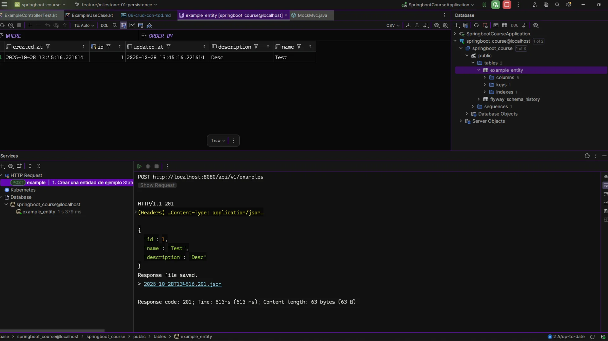
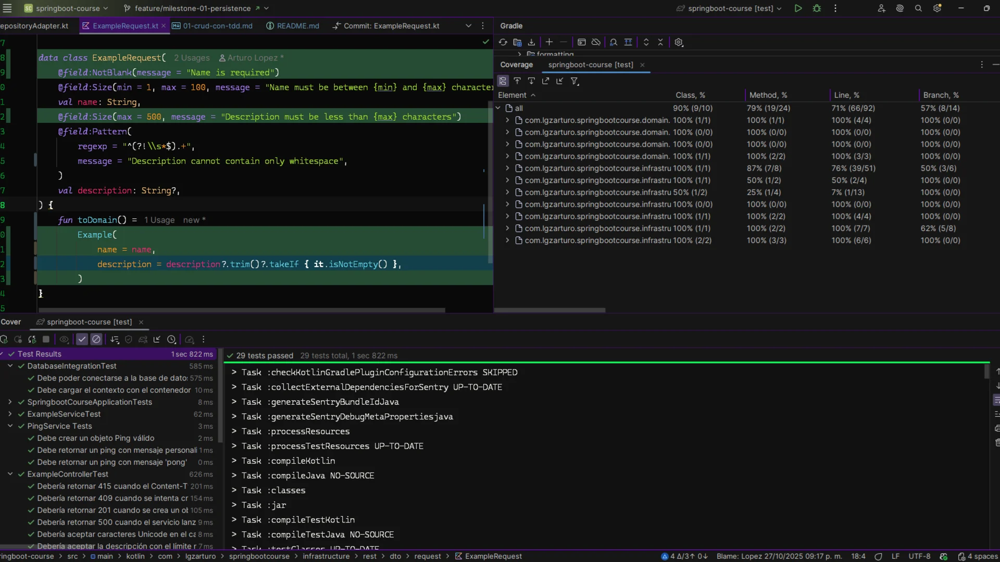

# CRUD con TDD

## 1. Estructura esperada para el CRUD con TDD

El flujo natural del CRUD bajo la arquitectura hexagonal debe ser iterativo y verificable en cada capa. Esta es la estructura objetivo y los archivos reales del repositorio que usaremos en el proceso:

```plaintext
src/main/kotlin/com/lgzarturo/springbootcourse/
└─ domain/
   ├─ model/
   │   └─ Example.kt                                ← Modelo de dominio (no JPA)
   ├─ port/
   │   ├─ input/
   │   │   └─ ExampleUseCase.kt                     ← Interfaces de entrada (casos de uso)
   │   └─ output/
   │       └─ ExampleRepositoryPort.kt              ← Interfaces de salida (persistencia)
   └─ service/
       └─ ExampleService.kt                         ← Implementación de casos de uso

└─ infrastructure/
   ├─ persistence/
   │   ├─ entity/
   │   │   └─ ExampleEntity.kt                      ← Entidad JPA
   │   ├─ repository/
   │   │   └─ ExampleJpaRepository.kt               ← Repository de Spring Data
   │   └─ adapter/
   │       └─ ExampleRepositoryAdapter.kt           ← Implementa el puerto de salida
   └─ rest/
       ├─ controller/
       │   └─ ExampleController.kt                  ← Endpoints REST
       └─ dto/
           ├─ request/ExampleRequest.kt
           └─ response/ExampleResponse.kt

src/test/kotlin/com/lgzarturo/springbootcourse/
└─ domain/service/ExampleServiceTest.kt
└─ infrastructure/rest/controller/ExampleControllerTest.kt
```

> Rama de trabajo: feature/milestone-01-persistence
> 
> La guía siguiente explica el flujo TDD Red → Green → Refactor por commits sobre esa rama, incluyendo ejemplos de código y rutas completas de archivos.

## 2. Creamos las pruebas unitarias básicas

Recordatorio del ciclo TDD:

```plaintext
🔴 Red → 🟢 Green → 🔵 Refactor
```

Paso 1 (🔴 Red): agregamos la primera prueba unitaria del dominio

- Archivo: `src/test/kotlin/com/lgzarturo/springbootcourse/domain/service/ExampleServiceTest.kt`

```kotlin
class ExampleServiceTest {
    private val repository = mock<ExampleRepositoryPort>()
    private val service = ExampleService(repository)

    @Test
    fun `should create a new example`() {
        val example = Example(id = null, name = "Test", description = "desc")

        whenever(repository.save(any())).thenReturn(example.copy(id = 1))

        val result = service.create(example)

        assertEquals(1, result.id)
        verify(repository).save(any())
    }
}
```

- Commit sugerido: test(domain): add ExampleServiceTest for create use case (falla)
- Dependencias de prueba necesarias en build.gradle.kts:

```kotlin
// build.gradle.kts
dependencies {
    testImplementation("org.mockito.kotlin:mockito-kotlin:5.2.1")
    testImplementation("org.junit.jupiter:junit-jupiter-api")
    testRuntimeOnly("org.junit.jupiter:junit-jupiter-engine")
    testImplementation("io.kotest:kotest-assertions-core:5.9.1")
}
```

Paso 2 (🟢 Green): hacemos que compile el dominio con lo mínimo

Creamos/ajustamos las clases del dominio y el puerto de salida.

- Archivo: `src/main/kotlin/com/lgzarturo/springbootcourse/domain/model/Example.kt`

```kotlin
data class Example(
    val id: Long? = null,
    val name: String,
    val description: String? = null,
)
```

- Archivo: `src/main/kotlin/com/lgzarturo/springbootcourse/domain/port/output/ExampleRepositoryPort.kt`

```kotlin
interface ExampleRepositoryPort {
    fun save(example: Example): Example
}
```

- Archivo: `src/main/kotlin/com/lgzarturo/springbootcourse/domain/service/ExampleService.kt`

```kotlin
class ExampleService(
    private val repository: ExampleRepositoryPort,
) {
    fun create(example: Example): Example = repository.save(example)
}
```

- Commit sugerido: feat(domain): add Example model, port and minimal ExampleService

Paso 3 (🔵 Refactor): limpieza menor en dominio si aplica

- Ajustes de estilo/nombres si fueran necesarios sin cambiar comportamiento.
- Commit sugerido: refactor(domain): minor clean-ups around Example

Paso 4 (🔴 Red): prueba de infraestructura (controlador REST)

- Archivo: `src/test/kotlin/com/lgzarturo/springbootcourse/infrastructure/rest/controller/ExampleControllerTest.kt`

```kotlin
@WebMvcTest(ExampleController::class)
class ExampleControllerTest(
    @Autowired val mockMvc: MockMvc,
) {
    @MockBean private lateinit var service: ExampleUseCase

    @Test
    fun `should return 201 when creating example`() {
        whenever(service.create(any())).thenReturn(Example(1, "Test", "Desc"))

        mockMvc
            .perform(
                post("/api/v1/examples")
                    .contentType(MediaType.APPLICATION_JSON)
                    .content("""{"name":"Test","description":"Desc"}"""),
            ).andExpect(status().isCreated)
            .andExpect(jsonPath("$.id").value(1))
            .andExpect(jsonPath("$.name").value("Test"))
    }
}
```

- Commit sugerido: test(web): add ExampleControllerTest for `POST /api/v1/examples` (falla)

Paso 5 (🟢 Green): añadimos controlador y DTOs mínimos

- Archivo: `src/main/kotlin/com/lgzarturo/springbootcourse/domain/port/input/ExampleUseCase.kt`

```kotlin
interface ExampleUseCase {
    fun create(example: Example): Example
}
```

- Archivo: `src/main/kotlin/com/lgzarturo/springbootcourse/infrastructure/rest/dto/request/ExampleRequest.kt`

```kotlin
data class ExampleRequest(
    val name: String,
    val description: String?,
) {
    fun toDomain() = Example(name = name, description = description)
}
```

- Archivo: `src/main/kotlin/com/lgzarturo/springbootcourse/infrastructure/rest/dto/response/ExampleResponse.kt`

```kotlin
data class ExampleResponse(
    val id: Long?,
    val name: String,
    val description: String?,
) {
    companion object {
        fun fromDomain(example: Example) = ExampleResponse(example.id, example.name, example.description)
    }
}
```

- Archivo: `src/main/kotlin/com/lgzarturo/springbootcourse/infrastructure/rest/controller/ExampleController.kt`

```kotlin
@RestController
@RequestMapping("/api/v1/examples")
@Tag(name = "Example", description = "Endpoints de prueba para ejemplos de TDD")
class ExampleController(
    private val service: ExampleUseCase,
) {
    @PostMapping
    fun create(
        @RequestBody request: ExampleRequest,
    ): ResponseEntity<ExampleResponse> {
        val example = service.create(request.toDomain())
        return ResponseEntity.status(HttpStatus.CREATED).body(ExampleResponse.fromDomain(example))
    }
}
```

- Commit sugerido: feat(web): add ExampleController + DTOs and wire with ExampleUseCase

Paso 6 (🔴 Red → 🟢 Green): persistencia mínima (adaptador + JPA)

Para que el servicio realmente persista, implementamos el puerto de salida con un adaptador de infraestructura.

- Archivo: `src/main/kotlin/com/lgzarturo/springbootcourse/infrastructure/persistence/entity/ExampleEntity.kt`

```kotlin
@Entity
@Table(name = "example_entity")
data class ExampleEntity(
    @Id
    @GeneratedValue(strategy = GenerationType.IDENTITY)
    val id: Long? = null,
    @Column(nullable = false)
    val name: String,
    @Column(columnDefinition = "TEXT")
    val description: String? = null,
    @Column(name = "created_at", nullable = false, updatable = false)
    val createdAt: LocalDateTime = LocalDateTime.now(),
    @Column(name = "updated_at", nullable = false)
    val updatedAt: LocalDateTime = LocalDateTime.now(),
) {
    fun toDomain() = Example(id, name, description)

    companion object {
        fun fromDomain(example: Example) =
            ExampleEntity(id = example.id, name = example.name, description = example.description)
    }
}
```

- Archivo: `src/main/kotlin/com/lgzarturo/springbootcourse/infrastructure/persistence/repository/ExampleJpaRepository.kt`

```kotlin
interface ExampleJpaRepository : JpaRepository<ExampleEntity, Long>
```

- Archivo: `src/main/kotlin/com/lgzarturo/springbootcourse/infrastructure/persistence/adapter/ExampleRepositoryAdapter.kt`

```kotlin
@Repository
class ExampleRepositoryAdapter(
    private val jpaRepository: ExampleJpaRepository,
) : ExampleRepositoryPort {
    override fun save(example: Example): Example {
        val entity = ExampleEntity.fromDomain(example)
        return jpaRepository.save(entity).toDomain()
    }
}
```

- Commits sugeridos:
  - feat(persistence): add ExampleEntity and ExampleJpaRepository
  - feat(persistence): add ExampleRepositoryAdapter implementing ExampleRepositoryPort

Paso 7 (🔵 Refactor): ordenar y documentar

- Revisa nombres, paquetes, y comentarios. Limpia imports y duplica la documentación si es necesario.
- Commit sugerido: docs: update TDD guide with commit log and full paths

Resultados esperados tras estos pasos

- El test de dominio pasa (creación de Example en memoria mediante mock del repositorio).
- El test del controlador pasa (`POST /api/v1/examples` retorna 201 con cuerpo JSON).
- Hay una ruta clara para continuar de forma iterativa con Read/Update/Delete repitiendo el ciclo TDD.

Ejecutar pruebas y verificar

- En Windows:
  - `gradlew.bat test`
- En Linux/Mac:
  - `./gradlew test`

Ejemplo de solicitud HTTP (manual)

```http
POST http://localhost:8080/api/v1/examples
Content-Type: application/json

{
  "name": "Test",
  "description": "Desc"
}
```

Paso 8: Ahora ye tenemos una prueba que pasa, implementamos el controlador y el puerto de salida.

Sin embargo, el endpoint no funciona, hay diversas razones, pero lo mas importante es resolver la inyección de dependencias de Spring.

Este es el error que vemos en la consola:

```bash
Description:

Parameter 0 of constructor in com.lgzarturo.springbootcourse.infrastructure.rest.controller.ExampleController required a bean of type 'com.lgzarturo.springbootcourse.domain.port.input.ExampleUseCase' that could not be found.


Action:

Consider defining a bean of type 'com.lgzarturo.springbootcourse.domain.port.input.ExampleUseCase' in your configuration.
```

Esto se debe a que no hemos implementado el puerto de entrada `ExampleUseCase` en ninguna clase, por lo que Spring no puede inyectarlo en el controlador.

Para resolverlo, agregamos una clase de servicio que implementa `ExampleUseCase` y lo inyectamos en el controlador.

- Archivo: `src/main/kotlin/com/lgzarturo/springbootcourse/domain/service/ExampleService.kt`

```kotlin
@Service
class ExampleService(
    private val repository: ExampleRepositoryPort,
) : ExampleUseCase {
    override fun create(example: Example): Example = repository.save(example)
}
```

De esta forma, ahora Spring puede inyectar el servicio en el controlador, debemos hacer un `override` en el controlador para que sepa que es el puerto de entrada y que implementa `ExampleUseCase`, para que user el método `create` que ya existe en el servicio. Dandole una implementación al método `create` que devuelve el objeto creado.

> Nota: Como puedes ver, la prueba pasa desde el paso 7, pero el endpoint no funciona hasta que implementamos el servicio que implementa el puerto de entrada. Ese es el flujo correcto del TDD, realizar pruebas, implementar y refactor. No quiere decir que te tengas que fiar de las pruebas, más bien usas las pruebas para aplicar un flujo de trabajo ordenado y estructurado.
> 
> Una vez que tienes las pruebas, cualquier cambio en el código que haga que las pruebas fallen te avisa de que algo no está bien, y puedes arreglarlo sin miedo a romper otras partes del código.



Con estos pasos ya tenemos implementado el endpoint de creación con TDD, enlazado a la rama [feature/milestone-01-persistence](https://github.com/lgzarturo/springboot-course/tree/refs/heads/feature/milestone-01-persistence) y con trazabilidad por commits. A partir de aquí, repite el ciclo para listar, obtener por id, actualizar y eliminar (*cada uno con su prueba fallando primero, implementación mínima y refactor*).

Paso 9: Agregar casos de uso para las pruebas.

> Ojo: Al agregar más casos de prueba, algunos van a fallar, eso es normal, otros van a pasar, eso es bueno, pero hay que tener cuidado con todos los casos de prueba.
> 
> Hay que ser conscientes que hay falsos positivos y falsos negativos. Por lo que la mejor estrategia es tomar los casos de uso como guía para validar el código, pero no fiarse ciegamente de ellos.

En este caso, seré sumamente detallado con los casos de uso que implementaremos, debido a que es una práctica deliberada, algo que me sirve para mejorar es prácticar una y otra vez las tecnicas de TDD.

Normalmente, no es necesario implementar todos los casos de uso, en el flujo de trabajo profesional, por lo regular, se realizan algunas pruebas básicas (*casos de uso esenciales*) y se confía en que el código funciona correctamente, pero en este caso, quiero practicar TDD al máximo.

Casos Implementados:

- ✅ Creación exitosa completa
- ✅ Creación sin descripción
- ✅ Request body vacío
- ✅ Campo 'name' ausente
- ✅ Campo 'name' vacío
- ✅ Campo 'name' excede límite
- ✅ Campo 'description' excede límite
- ✅ Campo 'name' solo espacios en blanco
- ✅ Campo 'description' solo espacios en blanco
- ✅ JSON malformado
- ✅ Content-Type incorrecto (415)
- ✅ Campos adicionales no esperados
- ✅ Campo 'name' es null
- ✅ Caracteres especiales en 'name'
- ✅ Caracteres Unicode en 'name'
- ✅ Excepción inesperada del servicio (500)
- ✅ Ejemplo duplicado (409 Conflict)
- ✅ Nombre con límite exacto (100 caracteres)
- ✅ Descripción con límite exacto (500 caracteres)
- ✅ Campo 'description' nulo explícito

Beneficios de Implementar Estos Casos

- Mayor cobertura de código (objetivo >80%)
- Validación robusta de entrada
- Cumplimiento de REST API best practices
- Mejor manejo de errores
- Documentación implícita del comportamiento esperado
- Prevención de bugs en producción
- Facilita el mantenimiento futuro

> Ahora ya sabes como implementar TDD en un proyecto Spring Boot, y como hacerlo con pruebas unitarias, este es el flujo de trabajo recomendado para TDD en proyectos Spring Boot. Es complicado definir que casos de uso son esenciales, pero es importante tenerlos en cuenta.
> 
> He encontrado que la mejor manera de acostumbrarse a TDD es practicarlo, y eso es lo que haremos en este curso.

## 3. Porcentaje de cobertura

### 📊 **Cobertura mostrada**

| Tipo de cobertura | Porcentaje  |
|-------------------|-------------|
| **Class**         | 90% (9/10)  |
| **Method**        | 79% (19/24) |
| **Line**          | 71% (66/92) |
| **Branch**        | 57% (8/14)  |

---

### 💡 **Qué significa cada uno**

* **Class % (90%)**: De todas las clases del proyecto (10), 9 tienen al menos una línea ejecutada por los tests.
* **Method % (79%)**: De los 24 métodos definidos, 19 se ejecutaron durante las pruebas.
* **Line % (71%)**: De las 92 líneas de código, 66 fueron realmente ejecutadas.
  > 👉 Este suele considerarse **el porcentaje de cobertura real**, porque refleja el código probado de manera efectiva.
* **Branch % (57%)**: De las 14 bifurcaciones lógicas (por ejemplo, `if/else` o `when`), solo 8 fueron cubiertas por los tests.

---

### ✅ **Conclusión**

En resumen la **cobertura real de código es del 71%**, porque:

* Representa la cantidad de **líneas ejecutadas vs. líneas totales**.
* Es el indicador más fiable para medir cuánto del código fue realmente probado.
* Los otros porcentajes (clases, métodos, ramas) complementan la información, pero el de **líneas** es el estándar para evaluar la cobertura global.

---

### 📘 Ejemplo práctico

De 92 líneas que existen en tu proyecto:

* 66 se ejecutaron durante los tests.
* Por eso:
  ``` 
  [ (66 ÷ 92) × 100 = 71.7% \approx 71% ]
  ```

> En estos casos si quisieramos mejorar esa cobertura, sería enfocarse en los tests que ejerciten las ramas condicionales (el **Branch Coverage**), que es donde estás más bajo (57%), ya que eso suele indicar caminos no probados dentro de funciones que sí se ejecutaron parcialmente. Sin embargo, puede ser que no sean necesarios todos esos casos de prueba, ya que se estarían probando caminos poco relevantes o improbables.
> 
> Nota: El código del framework no es necesario probarlo, ni de librerias de terceros, solo el código que tú escribes. Ese es un buen discriminador al momento de medir la cobertura. Probar entidades y repositorios no es necesario, ya que son código que se relacion con el framework o con la persistencia de datos.



## 4. ¿Qué probar y qué no?


### ✅ **Qué sí deberías probar (código propio)**

Enfócate en probar **tu lógica de negocio** y **las ramas relevantes del flujo**, es decir, el código que **tú escribiste y puede fallar por tus decisiones**:

1. **Casos con lógica condicional o validaciones**

    * `if`, `when`, `switch`, `try/catch`, etc.
    * Validaciones como tamaños, formatos, estados, permisos o reglas de negocio.
    > 👉 Ejemplo: en tu clase `ExampleRequest`, probar los casos donde `description` es `null`, vacía, o tiene solo espacios.

2. **Métodos con transformación o procesamiento de datos**

    * Cualquier función que convierte, filtra o mapea datos.
    > 👉 Ejemplo: `toDomain()` donde haces `trim()` y `takeIf`.

3. **Servicios con reglas de negocio**

    * Lógica central que decide *qué hacer* con los datos, no solo los pasa al repositorio.
    > 👉 Ejemplo: `ExampleService`, validaciones de estados, cálculo de totales, etc.

4. **Casos de error controlados**

    * Validar que los errores esperados (por ejemplo `BadRequest`, `NotFound`) se lanzan correctamente.
    > 👉 Ejemplo: tests que cubren “debería retornar 415 cuando el Content-Type es inválido”.

5. **Controladores (mínimamente)**

    * Solo los endpoints con lógica o validaciones adicionales (no todos los mapeos triviales).
    > 👉 Ejemplo: un `POST` que hace validación antes de llamar al servicio.

---

### ⚙️ **Qué no necesitas probar**

Estos casos **no agregan valor real a la cobertura** y solo inflan el porcentaje:

1. **Código del framework o librerías**

    * Spring, Hibernate, JPA, Jakarta Validation, etc.
    > ❌ No pruebes si `@Autowired` funciona o si `@Repository` guarda en DB; eso ya está probado por sus creadores.

2. **Entidades y repositorios**

    * Las clases que solo representan datos (`@Entity`, DTOs simples).
    * Interfaces `JpaRepository` o `CrudRepository`.
    > 👉 Solo deberías testearlos **si tienen lógica adicional** (por ejemplo, queries personalizados con `@Query`).

3. **Configuraciones, beans, y wiring del framework**

    * Archivos de configuración, `@Configuration`, `@Bean`.
    > 👉 Solo si agregas lógica condicional dentro (por ejemplo, `if (profile == "test")`).

4. **Código generado o utilidades triviales**

    * `equals()`, `hashCode()`, `toString()`, mappers sin lógica.
    > 👉 A menos que los hayas personalizado y puedan causar un bug.

---

### 📈 **Cómo interpretar la cobertura**

* La **cobertura de líneas (71%)** indica cuánto código propio se ejecuta.
* La **de ramas (57%)** te muestra cuántos caminos lógicos fueron realmente ejercitados.
  > 👉 Si una función tiene varios `if` o validaciones, cada condición cuenta como una rama.

No se trata de alcanzar 100%, sino de tener una **cobertura significativa**, donde:

* Las ramas **importantes** estén cubiertas.
* Las rutas **poco probables o triviales** (como validaciones duplicadas o nulas por seguridad) se dejen fuera.

---

### 💡 **Regla simple para decidir**

> "Si el código puede romper algo que el framework no controla, pruébalo.
> Si el código solo pasa datos al framework, no lo pruebes."

---

## Iteramos con TDD ahora con `GET /api/v1/examples/{id}`

Ahora el siguiente paso se debe de reiniciar el flujo de TDD, ya que se va a agregar una nueva ruta, y eso significa que hay que volver a implementar el controlador y el puerto de salida.

### Paso 1 (🔴 Red): agregamos los casos de uso

Se han creado los casos de prueba para el endpoint `GET /api/v1/examples/{id}` y el método de servicio asociado, siguiendo el contrato que ya se definio en el proceso anterior (ahora tomaremos en cuenta lo siguiente `findById(id: Long): Example?` y lanzar `NoSuchElementException` cuando no existe):

#### Controlador: `ExampleControllerTest.kt`

Se añadió el bloque `ShowExampleTests` con los siguientes escenarios:

- 200 OK cuando el recurso existe, validando cuerpo `id`, `name`, `description`.
- 200 OK omitiendo `description` cuando es `null` (no debe aparecer en el JSON).
- 404 Not Found cuando el servicio lanza `NoSuchElementException` (se valida `ErrorResponse.status` y `ErrorResponse.error`).
- 400 Bad Request cuando el `id` no es numérico (`abc`).
- 400 Bad Request cuando el `id` es `<= 0` (p. ej. `0`).
- 500 Internal Server Error cuando el servicio lanza una excepción inesperada (`RuntimeException`).

#### Servicio: `ExampleServiceTest.kt`

Se añadieron dos pruebas unitarias, con `ExampleRepositoryPort` mockeado:

- Caso exitoso: `should get an example by its id` cuando el repo devuelve un `Example`; se valida igualdad y `verify(repository).findById(1)`.
- Caso no encontrado: `should throw NoSuchElementException when example does not exist` cuando el repo devuelve `null`; se espera `NoSuchElementException` y `verify(repository).findById(1)`.

### Notas importantes (TDD – 🔴 Red)

- Estas pruebas asumen la existencia de nuevos métodos que aún NO están implementados, por lo cual es normal que el proyecto no compile/los tests fallen ahora (fase ROJA de TDD):
    - `ExampleUseCase.findById(id: Long): Example?`
    - `ExampleService.findById(id: Long): Example` (usando el puerto, lanzando `NoSuchElementException` si `null`)
    - `ExampleRepositoryPort.findById(id: Long): Example?`
    - `ExampleRepositoryAdapter.findById(id: Long): Example?` (adaptando `ExampleJpaRepository`)
    - En `ExampleController`, agregar `@GetMapping("/{id}")`, validar `id >= 1` (p. ej. `@Min(1)` o lógica que lance `IllegalArgumentException` → 400) y devolver `ExampleResponse.fromDomain(service.findById(id))` con `200 OK`.
    - En `GlobalExceptionHandler`, manejar `NoSuchElementException` como `404 Not Found` con `ErrorResponse` (actualmente hay utilitario para mapear por `status`; agrega un `@ExceptionHandler(NoSuchElementException::class)` que retorne `handleSpecificStatusCodeException(ex, request, HttpStatus.NOT_FOUND)`).

### Próximos pasos para poner todo en VERDE

1) Extender el puerto de entrada `ExampleUseCase` con `findById(id: Long): Example?` y su implementación en `ExampleService`:
   ```kotlin
   override fun findById(id: Long): Example =
       repository.findById(id) ?: throw NoSuchElementException("Example not found")
   ```
2) Extender el puerto de salida `ExampleRepositoryPort` con `findById(id: Long): Example?` y su implementación en `ExampleRepositoryAdapter` (usando tu `ExampleJpaRepository`).
3) Agregar `GET /api/v1/examples/{id}` en `ExampleController`:
    - `@GetMapping("/{id}")`
    - Validar `id >= 1` (anotación `@Min(1)` o if + `IllegalArgumentException`)
    - Retornar `ResponseEntity.ok(ExampleResponse.fromDomain(service.findById(id)))`.
4) Ahora en `GlobalExceptionHandler`, tenemos que agregar handler para `NoSuchElementException` → `404 Not Found` (construye `ErrorResponse` consistente, como ya haces para otros status mediante `handleSpecificStatusCodeException`). Hay que seguir la consistencia actual de los handlers ya implementados.
5) Por último se ejecuta la suite de tests; se refactoriza para corregir cualquier detalle menor de mapeo y se validan que todos los casos queden en verde.

## 🟢 Green - Listo

El método para obtener objetos por ID ya está implementado y probado con TDD, siguiendo el flujo Red → Green → Refactor. 

## 🔵 Refactor - Mejoras finales

Ahora ya se puede aplicar un refactor en el código, revisando nombres, paquetes, comentarios, limpieza de imports y duplicando la documentación si es necesario, para después hacer un commit final de refactorización.

## 🔴 Red - Continuamos el ciclo

En este punto, es importante entender que ya tenemos pruebas robustas de mucha de la funcionalidad que ya implementamos, y que ahora solo falta implementar las nuevas rutas y controladores, reutilizar lo que ya tenemos y seguir el mismo flujo de TDD para las nuevas funcionalidades.