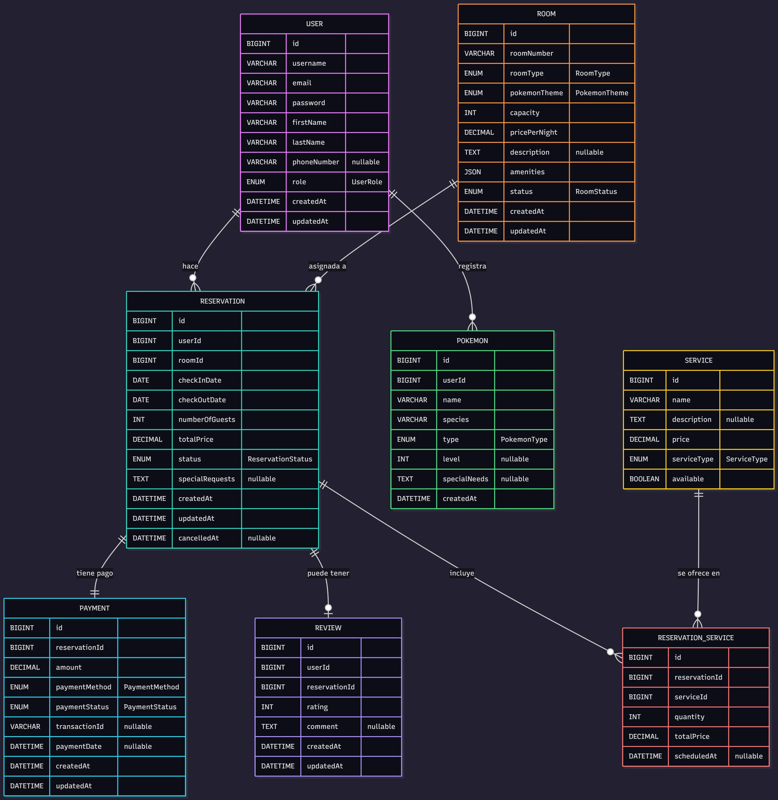
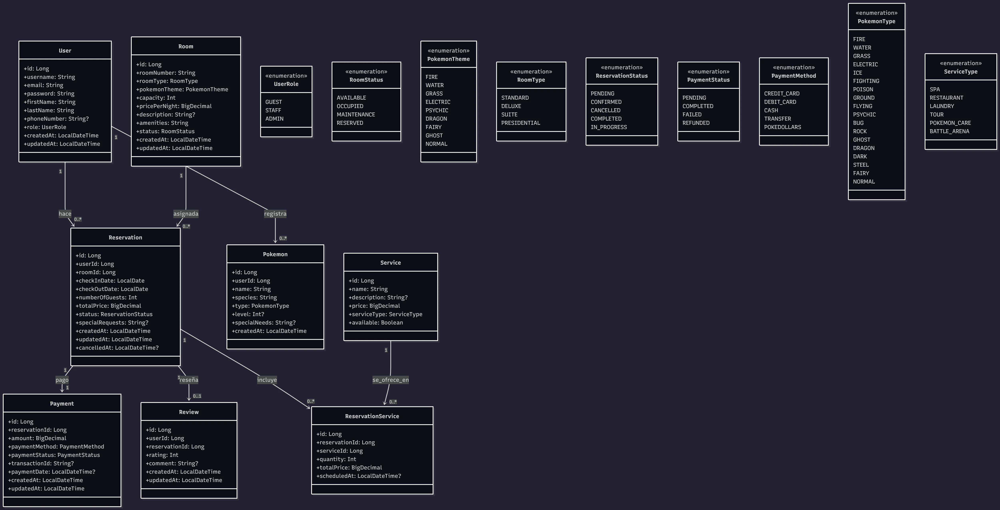

# Entidades del Sistema de Gestión Hotelera

Es necesario crear las entidades necesarias para el proyecto. A continuación se define el listado de entidades, que se deben crear, así como sus atributos y relaciones.

Siguiendo el camino del proyecto, podemos confirmar que ya tenemos la estructura implementada con la arquitectura Hexagonal, y se establecio el flujo del desarrollo TDD, se documentaron los principio SOLID y se establecieron las pruebas unitarias. En este punto, ya podemos empezar a desarrollar las funcionalidades, tenemos una base sólida de código, así como el manejo de errores y pruebas que nos permiten avanzar con confianza.

Estamos en la semana 3, y ahora toca avanzar con las entidades, sus relaciones y sus atributos, terminando la persistencia de los datos se creará un release con la versión 0.0.2 del proyecto.

Acorde a la narrativa del curso, se deben crear las entidades necesarias para el proyecto, que en este caso son:

Basándome en los documentos proporcionados, especialmente la historia del curso "El Legado del Desarrollador" y el proyecto final del Hotel Pokémon, aquí está el listado de entidades que se deben crear en el curso con sus relaciones:

## **Entidades Principales**

### 1. **User (Entrenador/Usuario)**

- **Propósito**: Representar a los entrenadores Pokémon que se hospedan en el hotel
- **Atributos principales**:
    - id: Long
    - username: String
    - email: String
    - password: String (hasheado)
    - firstName: String
    - lastName: String
    - phoneNumber: String?
    - role: UserRole (ENUM: GUEST, STAFF, ADMIN)
    - createdAt: LocalDateTime
    - updatedAt: LocalDateTime

### 2. **Room (Habitación)**
 
- **Propósito**: Habitaciones temáticas del hotel
- **Atributos principales**:
    - id: Long
    - roomNumber: String
    - roomType: RoomType (ENUM)
    - pokemonTheme: PokemonTheme (ENUM: FIRE, WATER, GRASS, ELECTRIC, etc.)
    - capacity: Int
    - pricePerNight: BigDecimal
    - description: String?
    - amenities: String (JSON o lista)
    - status: RoomStatus (ENUM: AVAILABLE, OCCUPIED, MAINTENANCE, RESERVED)
    - createdAt: LocalDateTime
    - updatedAt: LocalDateTime

### 3. **Reservation (Reserva)**
 
- **Propósito**: Gestionar las reservas de habitaciones
- **Atributos principales**:
    - id: Long
    - userId: Long
    - roomId: Long
    - checkInDate: LocalDate
    - checkOutDate: LocalDate
    - numberOfGuests: Int
    - totalPrice: BigDecimal
    - status: ReservationStatus (ENUM: PENDING, CONFIRMED, CANCELLED, COMPLETED, IN_PROGRESS)
    - specialRequests: String?
    - createdAt: LocalDateTime
    - updatedAt: LocalDateTime
    - cancelledAt: LocalDateTime?

### 4. **Payment (Pago)**

- **Propósito**: Gestionar los pagos de las reservas
- **Atributos principales**:
    - id: Long
    - reservationId: Long
    - amount: BigDecimal
    - paymentMethod: PaymentMethod (ENUM: CREDIT_CARD, DEBIT_CARD, CASH, TRANSFER)
    - paymentStatus: PaymentStatus (ENUM: PENDING, COMPLETED, FAILED, REFUNDED)
    - transactionId: String?
    - paymentDate: LocalDateTime?
    - createdAt: LocalDateTime
    - updatedAt: LocalDateTime

### 5. **Pokemon (Pokémon Acompañante)** *(Opcional/Avanzado)*

- **Propósito**: Registrar los Pokémon que acompañan a los entrenadores
- **Atributos principales**:
    - id: Long
    - userId: Long
    - name: String
    - species: String
    - type: PokemonType (ENUM)
    - level: Int?
    - specialNeeds: String?
    - createdAt: LocalDateTime

### 6. **Review (Reseña)** *(Opcional/Avanzado)*

- **Propósito**: Permitir que los huéspedes dejen reseñas
- **Atributos principales**:
    - id: Long
    - userId: Long
    - reservationId: Long
    - rating: Int (1-5)
    - comment: String?
    - createdAt: LocalDateTime
    - updatedAt: LocalDateTime

### 7. **Service (Servicio Adicional)** *(Opcional/Avanzado)*
 
- **Propósito**: Servicios adicionales del hotel (spa, restaurante, etc.)
- **Atributos principales**:
    - id: Long
    - name: String
    - description: String?
    - price: BigDecimal
    - serviceType: ServiceType (ENUM: SPA, RESTAURANT, LAUNDRY, TOUR, etc.)
    - available: Boolean

### 8. **ReservationService (Relación M2M)** *(Opcional/Avanzado)*
 
- **Propósito**: Vincular servicios adicionales con reservas
- **Atributos principales**:
    - id: Long
    - reservationId: Long
    - serviceId: Long
    - quantity: Int
    - totalPrice: BigDecimal
    - scheduledAt: LocalDateTime?

---

## 🔗 Relaciones entre Entidades

### **Relaciones Principales**



### **Detalle de Relaciones**

1. **User → Reservation** (`@OneToMany`)
    - Un usuario puede tener múltiples reservas
    - Una reserva pertenece a un usuario

2. **Room → Reservation** (`@OneToMany`)
    - Una habitación puede tener múltiples reservas (en diferentes fechas)
    - Una reserva es para una habitación específica

3. **Reservation → Payment** (`@OneToOne`)
    - Una reserva tiene un pago asociado
    - Un pago pertenece a una reserva

4. **User → Pokemon** (`@OneToMany`) *(Opcional)*
    - Un usuario puede registrar múltiples Pokémon
    - Un Pokémon pertenece a un usuario

5. **Reservation → Review** (`@OneToOne`) *(Opcional)*
    - Una reserva puede tener una reseña
    - Una reseña pertenece a una reserva

6. **Reservation ↔ Service** (`@ManyToMany`) *(Opcional)*
    - Una reserva puede incluir múltiples servicios
    - Un servicio puede estar en múltiples reservas
    - Tabla intermedia: `ReservationService`




---

## 📊 Enumeraciones (ENUMs)

```kotlin
enum class UserRole { GUEST, STAFF, ADMIN }

enum class RoomStatus { AVAILABLE, OCCUPIED, MAINTENANCE, RESERVED }

enum class PokemonTheme { 
    FIRE, WATER, GRASS, ELECTRIC, PSYCHIC, 
    DRAGON, FAIRY, GHOST, NORMAL 
}

enum class RoomType { 
    STANDARD, DELUXE, SUITE, PRESIDENTIAL 
}

enum class ReservationStatus { 
    PENDING, CONFIRMED, CANCELLED, COMPLETED, IN_PROGRESS 
}

enum class PaymentStatus { 
    PENDING, COMPLETED, FAILED, REFUNDED 
}

enum class PaymentMethod { 
    CREDIT_CARD, DEBIT_CARD, CASH, TRANSFER, POKEDOLLARS 
}

enum class PokemonType { 
    FIRE, WATER, GRASS, ELECTRIC, ICE, 
    FIGHTING, POISON, GROUND, FLYING, PSYCHIC, 
    BUG, ROCK, GHOST, DRAGON, DARK, 
    STEEL, FAIRY, NORMAL 
}

enum class ServiceType { 
    SPA, RESTAURANT, LAUNDRY, TOUR, 
    POKEMON_CARE, BATTLE_ARENA 
}
```

---

## 💡 Consideraciones de Arquitectura

- Seguir **Arquitectura Hexagonal** para todas las entidades
- Implementar **TDD** en cada caso (Red → Green → Refactor)
- Usar **DTOs** separados para Request/Response
- Implementar **validaciones con Jakarta Validation**
- Manejar errores con **GlobalExceptionHandler**
- Documentar con **OpenAPI/Swagger**
- Proteger endpoints con **Spring Security + JWT**
