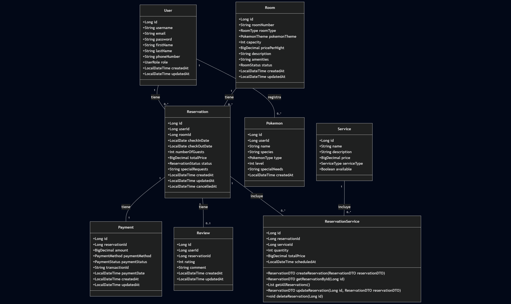

# Fases del proyecto

¡Perfecto, entrenador! Veo que Kai está a punto de comenzar su gran aventura en
el **Hotel Pokémon Spring Boot**. Con base en ese diagrama UML del proyecto
(),
es importante diseñar ejercicios progresivos, historia inmersiva y desafíos
técnicos concretos.

Aquí tienes el itinerario completo de la Liga Pokémon del Código:

---

## 🏨 FASE 1: Gimnasio de Pewter - "La Roca de la Persistencia"

**Líder:** Brock (especialista en bases de datos sólidas) **Insignia:** Boulder
Badge 💎 **Objetivo:** Domesticar las entidades y hacer que los datos persistan
como la roca más dura.

### 🎯 Ejercicios Técnicos

#### 1.1 Mapeo de Entidades JPA (Nivel: Pidgey)

Kai debe mapear todas las entidades del diagrama UML con anotaciones Kotlin:

```kotlin
@Entity
@Table(name = "rooms")
data class Room(
    @Id @GeneratedValue(strategy = GenerationType.IDENTITY)
    val id: Long? = null,

    @Column(name = "room_number", nullable = false, unique = true)
    val roomNumber: String,

    @Enumerated(EnumType.STRING)
    val roomType: RoomType,

    @Enumerated(EnumType.STRING)
    val pokemonTheme: PokemonTheme,

    val capacity: Int,

    @Column(precision = 10, scale = 2)
    val pricePerNight: BigDecimal,

    @OneToMany(mappedBy = "room", cascade = [CascadeType.ALL], fetch = FetchType.LAZY)
    val reservations: MutableList<Reservation> = mutableListOf()
)
```

**Desafío Team Rocket 🚀:** Brock advierte que Team Rocket intentó usar `EAGER`
fetching en todas las relaciones, causando el "N+1 Query of Doom". Kai debe
configurar correctamente el `FetchType` y usar `EntityGraph` cuando sea
necesario.

#### 1.2 Repositorios con Spring Data (Nivel: Geodude)

Crear repositorios con queries personalizadas:

```kotlin
@Repository
interface ReservationRepository : JpaRepository<Reservation, Long> {
    // Query derivada
    fun findByUserIdAndStatus(userId: Long, status: ReservationStatus): List<Reservation>

    // JPQL personalizado
    @Query("""
        SELECT r FROM Reservation r
        WHERE r.checkInDate BETWEEN :startDate AND :endDate
        AND r.status = 'CONFIRMED'
    """)
    fun findConfirmedReservationsInDateRange(
        @Param("startDate") start: LocalDate,
        @Param("endDate") end: LocalDate
    ): List<Reservation>

    // Native query para reportes complejos
    @Query("""
        SELECT r.room_id, COUNT(*) as total_reservations
        FROM reservations r
        WHERE r.created_at >= DATE_SUB(NOW(), INTERVAL 1 MONTH)
        GROUP BY r.room_id
    """, nativeQuery = true)
    fun findRoomPopularityStats(): List<Map<String, Any>>
}
```

#### 1.3 Patrón Adapter para Persistencia (Nivel: Onix)

Implementar arquitectura hexagonal:

```kotlin
// Puerto (Dominio)
interface ReservationPersistencePort {
    fun save(reservation: Reservation): Reservation
    fun findById(id: Long): Reservation?
    fun findActiveReservationsByUser(userId: Long): List<Reservation>
}

// Adaptador (Infraestructura)
@Component
class ReservationPersistenceAdapter(
    private val reservationRepository: ReservationRepository,
    private val reservationMapper: ReservationMapper
) : ReservationPersistencePort {

    override fun save(reservation: Reservation): Reservation {
        val entity = reservationMapper.toEntity(reservation)
        return reservationMapper.toDomain(reservationRepository.save(entity))
    }
    // ... implementación restante
}
```

#### 1.4 Migraciones con Flyway (Nivel: Steelix)

Crear scripts de migración versionados:

```sql
-- V1__initial_schema.sql
CREATE TABLE rooms (
    id BIGINT AUTO_INCREMENT PRIMARY KEY,
    room_number VARCHAR(10) NOT NULL UNIQUE,
    room_type VARCHAR(20) NOT NULL,
    pokemon_theme VARCHAR(30),
    capacity INT NOT NULL,
    price_per_night DECIMAL(10,2) NOT NULL,
    description VARCHAR(500),
    amenities VARCHAR(255),
    status VARCHAR(20) DEFAULT 'AVAILABLE',
    created_at TIMESTAMP DEFAULT CURRENT_TIMESTAMP,
    updated_at TIMESTAMP DEFAULT CURRENT_TIMESTAMP ON UPDATE CURRENT_TIMESTAMP
);

-- V2__add_user_roles.sql
CREATE TABLE users (
    id BIGINT AUTO_INCREMENT PRIMARY KEY,
    username VARCHAR(50) NOT NULL UNIQUE,
    email VARCHAR(100) NOT NULL UNIQUE,
    password VARCHAR(255) NOT NULL,
    role VARCHAR(20) DEFAULT 'TRAINER',
    first_name VARCHAR(50),
    last_name VARCHAR(50),
    phone_number VARCHAR(20),
    created_at TIMESTAMP DEFAULT CURRENT_TIMESTAMP,
    updated_at TIMESTAMP DEFAULT CURRENT_TIMESTAMP ON UPDATE CURRENT_TIMESTAMP
);

-- V3__reservation_constraints.sql
ALTER TABLE reservations
ADD CONSTRAINT chk_dates CHECK (check_out_date > check_in_date),
ADD CONSTRAINT chk_guests CHECK (number_of_guests > 0);
```

**Misión Especial:** Implementar un `FlywayCallback` que pre-poble la tabla
`rooms` con habitaciones temáticas de Pikachu, Charizard y Blastoise si la base
de datos está vacía.

---

## ⚡ FASE 2: Gimnasio de Vermilion - "El Trueno de la Seguridad"

**Líder:** Lt. Surge (experto en defensa eléctrica) **Insignia:** Thunder Badge
⚡ **Objetivo:** Proteger el Hotel Pokémon de intrusiones de Team Rocket.

### 🎯 Ejercicios Técnicos:

#### 2.1 Configuración Spring Security (Nivel: Voltorb)

Configuración Kotlin DSL:

```kotlin
@Configuration
@EnableWebSecurity
class SecurityConfig(
    private val jwtAuthenticationEntryPoint: JwtAuthenticationEntryPoint,
    private val jwtAuthenticationFilter: JwtAuthenticationFilter,
    private val userDetailsService: UserDetailsServiceImpl
) {

    @Bean
    fun filterChain(http: HttpSecurity): SecurityFilterChain {
        http {
            csrf { disable() }
            sessionManagement {
                sessionCreationPolicy = SessionCreationPolicy.STATELESS
            }
            authorizeHttpRequests {
                authorize("/api/auth/**", permitAll)
                authorize("/api/public/**", permitAll)
                authorize("/api/admin/**", hasRole("PROFESSOR_OAK")) // Admin
                authorize("/api/rooms/**", hasAnyRole("TRAINER", "GYM_LEADER", "PROFESSOR_OAK"))
                authorize("/api/reservations/**", authenticated)
                authorize(anyRequest, authenticated)
            }
            exceptionHandling {
                authenticationEntryPoint = jwtAuthenticationEntryPoint
            }
            addFilterBefore<UsernamePasswordAuthenticationFilter>(jwtAuthenticationFilter)
        }
        return http.build()
    }

    @Bean
    fun passwordEncoder(): PasswordEncoder = BCryptPasswordEncoder(12)
}
```

#### 2.2 JWT con Refresh Tokens (Nivel: Pikachu)

Implementar autenticación completa:

```kotlin
@Component
class JwtTokenProvider(
    @Value("\${app.jwt.secret}") private val jwtSecret: String,
    @Value("\${app.jwt.expiration-ms}") private val jwtExpirationMs: Long,
    @Value("\${app.jwt.refresh-expiration-ms}") private val refreshExpirationMs: Long
) {
    private val key = Keys.hmacShaKeyFor(jwtSecret.toByteArray(StandardCharsets.UTF_8))

    fun generateToken(userPrincipal: UserPrincipal): AuthToken {
        val now = Date()
        val expiryDate = Date(now.time + jwtExpirationMs)
        val refreshExpiryDate = Date(now.time + refreshExpirationMs)

        val accessToken = Jwts.builder()
            .setSubject(userPrincipal.id.toString())
            .claim("email", userPrincipal.email)
            .claim("role", userPrincipal.authorities.first().authority)
            .claim("type", "ACCESS")
            .setIssuedAt(now)
            .setExpiration(expiryDate)
            .signWith(key, SignatureAlgorithm.HS512)
            .compact()

        val refreshToken = Jwts.builder()
            .setSubject(userPrincipal.id.toString())
            .claim("type", "REFRESH")
            .setIssuedAt(now)
            .setExpiration(refreshExpiryDate)
            .signWith(key, SignatureAlgorithm.HS512)
            .compact()

        return AuthToken(accessToken, refreshToken, expiryDate.time)
    }

    fun validateToken(authToken: String): Boolean {
        return try {
            Jwts.parserBuilder().setSigningKey(key).build().parseClaimsJws(authToken)
            true
        } catch (ex: Exception) {
            when (ex) {
                is SecurityException -> logger.error("Firma JWT inválida")
                is MalformedJwtException -> logger.error("Token JWT malformado")
                is ExpiredJwtException -> logger.error("Token JWT expirado")
                is UnsupportedJwtException -> logger.error("Token JWT no soportado")
                is IllegalArgumentException -> logger.error("Claims JWT vacío")
                else -> logger.error("Error desconocido JWT")
            }
            false
        }
    }
}
```

#### 2.3 Autorización Basada en Roles (Nivel: Raichu)

Annotations personalizadas y método de seguridad:

```kotlin
// Anotación personalizada
@Target(AnnotationTarget.FUNCTION)
@Retention(AnnotationRetention.RUNTIME)
@PreAuthorize("hasRole('PROFESSOR_OAK') or @reservationSecurity.isOwner(#id, authentication)")
annotation class CanModifyReservation

// Servicio de seguridad de dominio
@Component("reservationSecurity")
class ReservationSecurityService(
    private val reservationRepository: ReservationRepository
) {
    fun isOwner(reservationId: Long, authentication: Authentication): Boolean {
        val userId = (authentication.principal as UserPrincipal).id
        return reservationRepository.findById(reservationId)
            .map { it.userId == userId }
            .orElse(false)
    }

    fun isRoomAvailableForRole(roomType: RoomType, authentication: Authentication): Boolean {
        val role = (authentication.principal as UserPrincipal).authorities.first().authority
        return when (roomType) {
            RoomType.ELITE_FOUR_SUITE -> role == "ROLE_PROFESSOR_OAK" || role == "ROLE_CHAMPION"
            RoomType.GYM_LEADER_SUITE -> role in listOf("ROLE_GYM_LEADER", "ROLE_PROFESSOR_OAK")
            else -> true
        }
    }
}

// Uso en controller
@RestController
@RequestMapping("/api/reservations")
class ReservationController(private val reservationService: ReservationService) {

    @CanModifyReservation
    @PutMapping("/{id}")
    fun updateReservation(@PathVariable id: Long, @RequestBody dto: ReservationDTO) =
        reservationService.update(id, dto)

    @PreAuthorize("@reservationSecurity.isRoomAvailableForRole(#dto.roomType, authentication)")
    @PostMapping
    fun createReservation(@RequestBody dto: ReservationDTO) =
        reservationService.create(dto)
}
```

**Trampa de Team Rocket 🚀:** Lt. Surge advierte que Team Rocket intenta hacer
JWT spoofing. Kai debe implementar `TokenBlacklist` usando Redis para invalidar
tokens en logout y detectar tokens robados.

---

## 🌊 FASE 3: Gimnasio de Cerulean - "La Cascada de la Validación"

**Líder:** Misty (perfeccionista del flujo) **Insignia:** Cascade Badge 🌊
**Objetivo:** Ningún dato inválido debe atravesar las defensas del hotel.

### 🎯 Ejercicios Técnicos

#### 3.1 Validaciones Personalizadas (Nivel: Staryu)

Validadores de dominio complejos:

```kotlin
// Anotación personalizada
@Target(AnnotationTarget.CLASS)
@Retention(AnnotationRetention.RUNTIME)
@Constraint(validatedBy = [ValidReservationPeriodValidator::class])
annotation class ValidReservationPeriod(
    val message: String = "Período de reserva inválido",
    val groups: Array<KClass<*>> = [],
    val payload: Array<KClass<out Payload>> = []
)

// Validator
class ValidReservationPeriodValidator : ConstraintValidator<ValidReservationPeriod, ReservationDTO> {
    override fun isValid(value: ReservationDTO, context: ConstraintValidatorContext): Boolean {
        if (value.checkInDate == null || value.checkOutDate == null) return true

        val isValid = value.checkOutDate.isAfter(value.checkInDate) &&
                     ChronoUnit.DAYS.between(value.checkInDate, value.checkOutDate) <= 30 &&
                     value.checkInDate.isAfter(LocalDate.now().minusDays(1))

        if (!isValid) {
            context.disableDefaultConstraintViolation()
            if (value.checkOutDate.isBefore(value.checkInDate)) {
                context.buildConstraintViolationWithTemplate("Check-out debe ser después de check-in")
                    .addPropertyNode("checkOutDate").addConstraintViolation()
            }
            if (ChronoUnit.DAYS.between(value.checkInDate, value.checkOutDate) > 30) {
                context.buildConstraintViolationWithTemplate("Máximo 30 días por reserva")
                    .addPropertyNode("checkOutDate").addConstraintViolation()
            }
        }
        return isValid
    }
}

// Uso
@ValidReservationPeriod
data class ReservationDTO(
    @field:NotNull
    @field:FutureOrPresent
    val checkInDate: LocalDate?,

    @field:NotNull
    @field:Future
    val checkOutDate: LocalDate?,

    @field:Min(1)
    @field:Max(10)
    val numberOfGuests: Int,

    @field:ValidPokemonSpecies // Otra validación custom
    val companionPokemon: String?
)
```

#### 3.2 Excepciones de Dominio (Nivel: Starmie)

Jerarquía de excepciones typed:

```kotlin
// Clase base sellada
sealed class HotelBusinessException(
    message: String,
    val errorCode: ErrorCode,
    val details: Map<String, Any> = emptyMap()
) : RuntimeException(message)

// Excepciones específicas
class RoomNotAvailableException(
    roomId: Long,
    dates: Pair<LocalDate, LocalDate>
) : HotelBusinessException(
    "La habitación $roomId no está disponible para las fechas ${dates.first} al ${dates.second}",
    ErrorCode.ROOM_NOT_AVAILABLE,
    mapOf("roomId" to roomId, "checkIn" to dates.first, "checkOut" to dates.second)
)

class InsufficientPaymentException(
    required: BigDecimal,
    provided: BigDecimal
) : HotelBusinessException(
    "Pago insuficiente. Requerido: $required, Proporcionado: $provided",
    ErrorCode.PAYMENT_INSUFFICIENT,
    mapOf("required" to required, "provided" to provided)
)

class PokemonNotAllowedException(
    pokemonType: PokemonType,
    roomType: RoomType
) : HotelBusinessException(
    "Los Pokémon tipo $pokemonType no están permitidos en habitaciones $roomType",
    ErrorCode.POKEMON_NOT_ALLOWED,
    mapOf("pokemonType" to pokemonType, "roomType" to roomType)
)

enum class ErrorCode {
    ROOM_NOT_AVAILABLE,
    PAYMENT_INSUFFICIENT,
    POKEMON_NOT_ALLOWED,
    RESERVATION_CONFLICT,
    USER_NOT_FOUND
}
```

#### 3.3 Manejo Global de Errores (Nivel: Gyarados)

ControllerAdvice sofisticado:

```kotlin
@RestControllerAdvice
class GlobalExceptionHandler(private val messageSource: MessageSource) {

    @ExceptionHandler(HotelBusinessException::class)
    fun handleBusinessException(
        ex: HotelBusinessException,
        request: HttpServletRequest
    ): ResponseEntity<ErrorResponse> {
        val errorResponse = ErrorResponse(
            timestamp = LocalDateTime.now(),
            status = HttpStatus.CONFLICT.value(),
            error = ex.errorCode.name,
            message = ex.message,
            path = request.requestURI,
            details = ex.details,
            traceId = MDC.get("traceId")
        )

        // Logging estructurado
        logger.error("Error de negocio: ${ex.errorCode}", StructuredArguments.entries(ex.details))

        return ResponseEntity.status(HttpStatus.CONFLICT).body(errorResponse)
    }

    @ExceptionHandler(MethodArgumentNotValidException::class)
    fun handleValidationErrors(
        ex: MethodArgumentNotValidException,
        request: HttpServletRequest
    ): ResponseEntity<ValidationErrorResponse> {
        val errors = ex.bindingResult.fieldErrors.map {
            FieldErrorDetail(
                field = it.field,
                rejectedValue = it.rejectedValue,
                message = it.defaultMessage ?: "Error de validación"
            )
        }

        return ResponseEntity.badRequest().body(
            ValidationErrorResponse(
                message = "Error de validación en los datos enviados",
                errors = errors,
                path = request.requestURI
            )
        )
    }

    @ExceptionHandler(Exception::class)
    fun handleGenericException(ex: Exception, request: HttpServletRequest): ResponseEntity<ErrorResponse> {
        // Aquí se integraría con Sentry o similar
        logger.error("Error inesperado", ex)

        return ResponseEntity.status(HttpStatus.INTERNAL_SERVER_ERROR).body(
            ErrorResponse(
                message = "Ha ocurrido un error interno. El Profesor Oak ha sido notificado.",
                error = "INTERNAL_ERROR",
                status = 500,
                path = request.requestURI,
                timestamp = LocalDateTime.now()
            )
        )
    }
}
```

**Desafío Misty:** Implementar validación asíncrona usando `@Async` para
verificar disponibilidad de habitaciones en tiempo real sin bloquear el hilo
principal.

---

## 🌱 FASE 4: Gimnasio de Celadon - "El Jardín del Testing"

**Líder:** Erika (maestra de la perfección) **Insignia:** Rainbow Badge 🌈
**Objetivo:** Código sin tests es como un Pokémon sin entrenar.

### 🎯 Ejercicios Técnicos

#### 4.1 Tests Unitarios con MockK (Nivel: Oddish)

Testeo de servicios de dominio:

```kotlin
@ExtendWith(MockKExtension::class)
class ReservationServiceTest {

    @MockK
    private lateinit var reservationPersistencePort: ReservationPersistencePort

    @MockK
    private lateinit var roomRepository: RoomRepository

    @MockK
    private lateinit var paymentService: PaymentService

    @InjectMockKs
    private lateinit var reservationService: ReservationService

    @Test
    fun `should create reservation when room is available`() {
        // Given
        val dto = ReservationDTO(
            roomId = 1L,
            userId = 42L,
            checkInDate = LocalDate.now().plusDays(1),
            checkOutDate = LocalDate.now().plusDays(3),
            numberOfGuests = 2
        )

        every { roomRepository.findById(1L) } returns Optional.of(createRoom())
        every { reservationPersistencePort.findOverlappingReservations(any(), any(), any()) } returns emptyList()
        every { reservationPersistencePort.save(any()) } returns createReservation()

        // When
        val result = reservationService.create(dto)

        // Then
        assertNotNull(result)
        assertEquals(ReservationStatus.PENDING, result.status)
        verify { reservationPersistencePort.save(any()) }
    }

    @Test
    fun `should throw RoomNotAvailableException when dates overlap`() {
        // Given
        val dto = createReservationDTO()
        every { roomRepository.findById(any()) } returns Optional.of(createRoom())
        every { reservationPersistencePort.findOverlappingReservations(any(), any(), any()) } returns
            listOf(createReservation()) // Ya existe una reserva

        // When/Then
        val exception = assertThrows<RoomNotAvailableException> {
            reservationService.create(dto)
        }

        assertEquals(ErrorCode.ROOM_NOT_AVAILABLE, exception.errorCode)
        verify(exactly = 0) { reservationPersistencePort.save(any()) }
    }

    @Test
    fun `should calculate total price correctly including services`() {
        // Given
        val room = createRoom(pricePerNight = BigDecimal("100.00"))
        val services = listOf(
            ReservationService(serviceId = 1L, quantity = 2, unitPrice = BigDecimal("25.00")), // $50
            ReservationService(serviceId = 2L, quantity = 1, unitPrice = BigDecimal("15.00"))  // $15
        )

        // When
        val total = reservationService.calculateTotal(room, 3, services) // 3 noches

        // Then
        assertEquals(BigDecimal("365.00"), total) // 300 + 50 + 15
    }
}
```

#### 4.2 Tests de Integración con @DataJpaTest (Nivel: Gloom)

Testeo de repositorios con TestContainers:

```kotlin
@DataJpaTest
@AutoConfigureTestDatabase(replace = AutoConfigureTestDatabase.Replace.NONE)
@Testcontainers
class ReservationRepositoryIntegrationTest {

    companion object {
        @Container
        val postgres = PostgreSQLContainer("postgres:15-alpine")
            .withDatabaseName("hotel_pokemon_test")
            .withUsername("test")
            .withPassword("test")

        @JvmStatic
        @DynamicPropertySource
        fun properties(registry: DynamicPropertyRegistry) {
            registry.add("spring.datasource.url", postgres::getJdbcUrl)
            registry.add("spring.datasource.username", postgres::getUsername)
            registry.add("spring.datasource.password", postgres::getPassword)
        }
    }

    @Autowired
    private lateinit var reservationRepository: ReservationRepository

    @Autowired
    private lateinit var entityManager: TestEntityManager

    @Test
    fun `should find overlapping reservations correctly`() {
        // Setup
        val room = entityManager.persistAndFlush(createRoom())
        val user = entityManager.persistAndFlush(createUser())

        // Reserva existente: 10-15 de enero
        entityManager.persistAndFlush(createReservation(
            room = room,
            user = user,
            checkIn = LocalDate.of(2026, 1, 10),
            checkOut = LocalDate.of(2026, 1, 15)
        ))

        // Test cases
        val overlappingCases = listOf(
            LocalDate.of(2026, 1, 8) to LocalDate.of(2026, 1, 12),  // Empieza antes, termina durante
            LocalDate.of(2026, 1, 12) to LocalDate.of(2026, 1, 18), // Empieza durante, termina después
            LocalDate.of(2026, 1, 11) to LocalDate.of(2026, 1, 14), // Dentro completamente
            LocalDate.of(2026, 1, 8) to LocalDate.of(2026, 1, 18)   // Cubre completamente
        )

        overlappingCases.forEach { (checkIn, checkOut) ->
            val result = reservationRepository.findOverlappingReservations(
                roomId = room.id!!,
                checkIn = checkIn,
                checkOut = checkOut
            )
            assertThat(result).isNotEmpty()
        }

        // Caso no superpuesto: debe estar vacío
        val nonOverlapping = reservationRepository.findOverlappingReservations(
            roomId = room.id!!,
            checkIn = LocalDate.of(2026, 1, 16),
            checkOut = LocalDate.of(2026, 1, 20)
        )
        assertThat(nonOverlapping).isEmpty()
    }
}
```

#### 4.3 Tests E2E con MockMvc y RestAssured (Nivel: Vileplume)

Flujo completo de reserva:

```kotlin
@SpringBootTest(webEnvironment = SpringBootTest.WebEnvironment.RANDOM_PORT)
@AutoConfigureMockMvc
@Testcontainers
class ReservationE2ETest {

    @Autowired
    private lateinit var mockMvc: MockMvc

    @Autowired
    private lateinit var objectMapper: ObjectMapper

    @Autowired
    private lateinit var jwtTokenProvider: JwtTokenProvider

    @Test
    fun `complete reservation flow - from creation to payment`() {
        // 1. Login y obtener token
        val authToken = loginAsTrainer("kai@pokemon.com", "pikachu123")

        // 2. Buscar habitaciones disponibles
        val roomsJson = mockMvc.get("/api/rooms/available") {
            header("Authorization", "Bearer $authToken")
            param("checkIn", "2026-05-01")
            param("checkOut", "2026-05-05")
            param("guests", "2")
        }.andExpect {
            status { isOk() }
            jsonPath("$[0].roomType") { exists() }
        }.andReturn().response.contentAsString

        val rooms = objectMapper.readValue<List<RoomDTO>>(roomsJson)
        val selectedRoom = rooms.first()

        // 3. Crear reserva
        val reservationRequest = CreateReservationRequest(
            roomId = selectedRoom.id,
            checkInDate = LocalDate.of(2026, 5, 1),
            checkOutDate = LocalDate.of(2026, 5, 5),
            numberOfGuests = 2,
            services = listOf(ServiceRequest(1L, 1)) // Centro Pokémon
        )

        val reservationJson = mockMvc.post("/api/reservations") {
            header("Authorization", "Bearer $authToken")
            contentType = MediaType.APPLICATION_JSON
            content = objectMapper.writeValueAsString(reservationRequest)
        }.andExpect {
            status { isCreated() }
            jsonPath("$.status") { value("PENDING") }
            jsonPath("$.totalPrice") { exists() }
        }.andReturn().response.contentAsString

        val reservation = objectMapper.readValue<ReservationDTO>(reservationJson)

        // 4. Procesar pago
        val paymentRequest = PaymentRequest(
            reservationId = reservation.id,
            amount = reservation.totalPrice,
            method = PaymentMethod.CREDIT_CARD,
            cardToken = "tok_visa"
        )

        mockMvc.post("/api/payments") {
            header("Authorization", "Bearer $authToken")
            contentType = MediaType.APPLICATION_JSON
            content = objectMapper.writeValueAsString(paymentRequest)
        }.andExpect {
            status { isOk() }
            jsonPath("$.paymentStatus") { value("COMPLETED") }
        }

        // 5. Verificar que la reserva está confirmada
        mockMvc.get("/api/reservations/${reservation.id}") {
            header("Authorization", "Bearer $authToken")
        }.andExpect {
            status { isOk() }
            jsonPath("$.status") { value("CONFIRMED") }
        }
    }
}
```

#### 4.4 Tests de Performance con JMH (Nivel: Bellossom)

Benchmark de consultas críticas:

```kotlin
@State(Scope.Benchmark)
@BenchmarkMode(Mode.AverageTime)
@OutputTimeUnit(TimeUnit.MILLISECONDS)
@Warmup(iterations = 3)
@Measurement(iterations = 5)
class RoomAvailabilityBenchmark {

    private lateinit var roomService: RoomService
    private val faker = Faker()

    @Setup
    fun setup() {
        // Configurar contexto de Spring manualmente o usar @SpringBootTest
        val ctx = SpringApplication.run(HotelPokemonApplication::class.java)
        roomService = ctx.getBean(RoomService::class.java)

        // Pre-cargar datos de prueba (1000 habitaciones, 10000 reservas)
        setupTestData()
    }

    @Benchmark
    fun testComplexAvailabilityQuery() {
        val checkIn = LocalDate.now().plusDays((1..30).random().toLong())
        val checkOut = checkIn.plusDays((1..7).random().toLong())

        roomService.findAvailableRooms(
            checkIn = checkIn,
            checkOut = checkOut,
            capacity = (1..4).random(),
            roomType = RoomType.values().random(),
            pageable = PageRequest.of(0, 20)
        )
    }

    @Benchmark
    fun testConcurrentReservations() {
        // Simular 10 usuarios intentando reservar la misma habitación simultáneamente
        val threads = (1..10).map {
            thread {
                try {
                    roomService.holdRoomTemporarily(roomId = 1L, durationMinutes = 5)
                } catch (ex: RoomNotAvailableException) {
                    // Esperado cuando otro hilo ya tomó la habitación
                }
            }
        }
        threads.forEach { it.join() }
    }
}
```

**Reto Erika:** Alcanzar 80% de cobertura de código y 100% de cobertura en
lógica de negocio crítica (cálculos de precios, disponibilidad).

---

## 🧪 FASE 5: Gimnasio de Cinnabar - "El Laboratorio de la Observabilidad"

**Líder:** Blaine (científico de datos) **Insignia:** Volcano Badge 🌋
**Objetivo:** Monitorizar cada rincón del hotel como si fuera un experimento.

### 🎯 Ejercicios Técnicos

#### 5.1 Logging Estructurado con Logback y JSON (Nivel: Ponyta)

Configuración avanzada:

```kotlin
// logback-spring.xml
<configuration>
    <property name="LOG_PATTERN" value="%d{ISO8601} %5p [%t] %X{traceId:-} %X{userId:-} %m%n"/>

    <appender name="CONSOLE" class="ch.qos.logback.core.ConsoleAppender">
        <encoder class="net.logstash.logback.encoder.LogstashEncoder">
            <includeContext>true</includeContext>
            <includeMdc>true</includeMdc>
            <customFields>{"service":"hotel-pokemon","version":"1.0.0"}</customFields>
        </encoder>
    </appender>

    <appender name="FILE" class="ch.qos.logback.core.rolling.RollingFileAppender">
        <file>logs/application.log</file>
        <rollingPolicy class="ch.qos.logback.core.rolling.TimeBasedRollingPolicy">
            <fileNamePattern>logs/application.%d{yyyy-MM-dd}.%i.log</fileNamePattern>
            <maxHistory>30</maxHistory>
            <timeBasedFileNamingAndTriggeringPolicy class="ch.qos.logback.core.rolling.SizeAndTimeBasedFNATP">
                <maxFileSize>100MB</maxFileSize>
            </timeBasedFileNamingAndTriggeringPolicy>
        </rollingPolicy>
        <encoder class="net.logstash.logback.encoder.LogstashEncoder"/>
    </appender>

    <logger name="com.hotelpokemon" level="DEBUG"/>
    <logger name="org.springframework.security" level="DEBUG"/>

    <root level="INFO">
        <appender-ref ref="CONSOLE"/>
        <appender-ref ref="FILE"/>
    </root>
</configuration>
```

Interceptor MDC:

```kotlin
@Component
class MdcInterceptor : HandlerInterceptor {
    override fun preHandle(request: HttpServletRequest, response: HttpServletResponse, handler: Any): Boolean {
        val traceId = request.getHeader("X-Trace-Id") ?: UUID.randomUUID().toString()
        val userId = SecurityContextHolder.getContext().authentication?.name ?: "anonymous"

        MDC.put("traceId", traceId)
        MDC.put("userId", userId)
        MDC.put("path", request.requestURI)
        MDC.put("method", request.method)

        response.setHeader("X-Trace-Id", traceId)
        return true
    }

    override fun afterCompletion(request: HttpServletRequest, response: HttpServletResponse, handler: Any, ex: Exception?) {
        MDC.clear()
    }
}
```

Logging semántico en servicios:

```kotlin
@Service
class ReservationService(
    private val logger: Logger = LoggerFactory.getLogger(ReservationService::class.java)
) {
    fun createReservation(dto: ReservationDTO): Reservation {
        logger.info("Iniciando creación de reserva", StructuredArguments.entries(mapOf(
            "roomId" to dto.roomId,
            "userId" to dto.userId,
            "checkIn" to dto.checkInDate,
            "nights" to ChronoUnit.DAYS.between(dto.checkInDate, dto.checkOutDate)
        )))

        return try {
            val reservation = processReservation(dto)
            logger.info("Reserva creada exitosamente", StructuredArguments.entries(mapOf(
                "reservationId" to reservation.id,
                "totalAmount" to reservation.totalPrice,
                "status" to reservation.status
            )))
            reservation
        } catch (ex: RoomNotAvailableException) {
            logger.warn("Fallo en disponibilidad", StructuredArguments.entries(mapOf(
                "roomId" to dto.roomId,
                "dates" to "${dto.checkInDate} to ${dto.checkOutDate}",
                "errorCode" to ex.errorCode
            )))
            throw ex
        }
    }
}
```

#### 5.2 Métricas Personalizadas con Micrometer (Nivel: Rapidash)

Métricas de negocio:

```kotlin
@Component
class HotelMetrics(private val meterRegistry: MeterRegistry) {

    // Contador de reservas por tipo de habitación
    fun recordReservationCreated(roomType: RoomType, amount: BigDecimal) {
        Counter.builder("hotel.reservations.created")
            .tag("room_type", roomType.name)
            .register(meterRegistry)
            .increment()

        // Distribución de montos
        DistributionSummary.builder("hotel.reservations.amount")
            .baseUnit("USD")
            .publishPercentiles(0.5, 0.95, 0.99)
            .register(meterRegistry)
            .record(amount.toDouble())
    }

    // Timer para operaciones críticas
    fun <T> timeReservationOperation(operation: String, block: () -> T): T {
        return meterRegistry.timer("hotel.reservation.operation", "type", operation)
            .recordCallable(block)!!
    }

    // Gauge para disponibilidad actual
    @PostConstruct
    fun initRoomAvailabilityGauge() {
        Gauge.builder("hotel.rooms.available") {
            roomRepository.countByStatus(RoomStatus.AVAILABLE).toDouble()
        }.tag("status", "available")
         .register(meterRegistry)
    }

    // Contador de errores de negocio
    fun recordBusinessError(errorCode: ErrorCode) {
        Counter.builder("hotel.errors.business")
            .tag("error_code", errorCode.name)
            .register(meterRegistry)
            .increment()
    }
}

// Uso en servicio
@Service
class ReservationService(
    private val hotelMetrics: HotelMetrics
) {
    fun create(dto: ReservationDTO): Reservation {
        return hotelMetrics.timeReservationOperation("create") {
            // lógica de creación
            val reservation = ...
            hotelMetrics.recordReservationCreated(reservation.roomType, reservation.totalPrice)
            reservation
        }
    }
}
```

#### 5.3 Distributed Tracing con Micrometer Tracing y Zipkin (Nivel: Moltres)

Configuración de tracing:

```yaml
# application.yml
management:
  tracing:
    sampling:
      probability: 1.0
  zipkin:
    tracing:
      endpoint: http://localhost:9411/api/v2/spans
  endpoints:
    web:
      exposure:
        include: health,info,metrics,prometheus,loggers
  metrics:
    export:
      prometheus:
        enabled: true
```

Tracing personalizado en operaciones asíncronas:

```kotlin
@Service
class AsyncReservationProcessor(
    private val tracer: Tracer,
    private val reservationRepository: ReservationRepository
) {
    @Async
    fun processPaymentAsync(reservationId: Long, paymentDetails: PaymentDetails) {
        val newSpan = tracer.nextSpan().name("process-payment-async").start()

        try {
            tracer.withSpan(newSpan).use {
                // Llamada a servicio externo de pagos
                val paymentResult = paymentGateway.charge(paymentDetails)

                if (paymentResult.success) {
                    updateReservationStatus(reservationId, ReservationStatus.CONFIRMED)
                    newSpan.event("Payment confirmed")
                } else {
                    newSpan.event("Payment failed")
                    newSpan.tag("error", paymentResult.errorMessage)
                }
            }
        } finally {
            newSpan.end()
        }
    }
}
```

**Experimento Blaine:** Crear un dashboard en Grafana que muestre:

- Tasa de ocupación del hotel en tiempo real
- Ingresos por hora
- Tiempo promedio de checkout
- Errores de Team Rocket (intentos de acceso no autorizado) detectados por hora

---

## 🐉 FASE 6: Gimnasio de Viridian - "La Liga de la Entrega Continua"

**Líder:** Giovanni (arquitecto de sistemas) **Insignia:** Earth Badge 🌍
**Objetivo:** El hotel debe operar 24/7 sin interrupciones.

### 🎯 Ejercicios Técnicos

#### 6.1 Dockerización Multi-stage (Nivel: Rhyhorn)

Dockerfile optimizado:

```dockerfile
# Etapa 1: Build
FROM eclipse-temurin:17-jdk-alpine AS builder
WORKDIR /app
COPY gradlew gradle.properties build.gradle.kts settings.gradle.kts ./
COPY gradle ./gradle
COPY src ./src

# Cache de dependencias
RUN ./gradlew dependencies --no-daemon

# Build
RUN ./gradlew bootJar --no-daemon -x test

# Etapa 2: Runtime
FROM eclipse-temurin:17-jre-alpine
LABEL maintainer="Profesor Oak <oak@pokemon.com>"
LABEL version="1.0.0"
LABEL description="Hotel Pokemon Spring Boot API"

# Crear usuario no-root por seguridad
RUN addgroup -S pokemon && adduser -S ash -G pokemon
USER ash:pokemon

WORKDIR /app

# Copiar JAR
COPY --from=builder --chown=ash:pokemon /app/build/libs/*.jar app.jar

# Health check
HEALTHCHECK --interval=30s --timeout=3s --start-period=60s --retries=3 \
    CMD wget --no-verbose --tries=1 --spider http://localhost:8080/actuator/health || exit 1

EXPOSE 8080

# JVM tuning para contenedores
ENV JAVA_OPTS="-XX:+UseContainerSupport \
               -XX:MaxRAMPercentage=75.0 \
               -XX:+OptimizeStringConcat \
               -XX:+UseStringDeduplication \
               -Djava.security.egd=file:/dev/./urandom"

ENTRYPOINT ["sh", "-c", "java $JAVA_OPTS -jar app.jar"]
```

docker-compose completo:

```yaml
version: '3.8'

services:
  app:
    build: .
    container_name: hotel-pokemon-api
    ports:
      - '8080:8080'
    environment:
      - SPRING_PROFILES_ACTIVE=docker
      - SPRING_DATASOURCE_URL=jdbc:postgresql://db:5432/hotel_pokemon
      - SPRING_REDIS_HOST=redis
      - SPRING_ZIPKIN_BASE_URL=http://zipkin:9411
    depends_on:
      db:
        condition: service_healthy
      redis:
        condition: service_started
    networks:
      - hotel-network
    restart: unless-stopped

  db:
    image: postgres:15-alpine
    container_name: hotel-pokemon-db
    environment:
      - POSTGRES_DB=hotel_pokemon
      - POSTGRES_USER=ash
      - POSTGRES_PASSWORD=pikachu123
    volumes:
      - postgres_data:/var/lib/postgresql/data
      - ./init-scripts:/docker-entrypoint-initdb.d
    healthcheck:
      test: ['CMD-SHELL', 'pg_isready -U ash -d hotel_pokemon']
      interval: 5s
      timeout: 5s
      retries: 5
    networks:
      - hotel-network

  redis:
    image: redis:7-alpine
    container_name: hotel-pokemon-cache
    volumes:
      - redis_data:/data
    networks:
      - hotel-network

  nginx:
    image: nginx:alpine
    container_name: hotel-pokemon-gateway
    ports:
      - '80:80'
      - '443:443'
    volumes:
      - ./nginx.conf:/etc/nginx/nginx.conf:ro
      - ./ssl:/etc/nginx/ssl:ro
    depends_on:
      - app
    networks:
      - hotel-network

volumes:
  postgres_data:
  redis_data:

networks:
  hotel-network:
    driver: bridge
```

#### 6.2 Pipeline CI/CD con GitHub Actions (Nivel: Rhydon)

Workflow completo:

```yaml
# .github/workflows/pokemon-pipeline.yml
name: Hotel Pokemon CI/CD

on:
  push:
    branches: [main, develop]
  pull_request:
    branches: [main]

jobs:
  test:
    name: 🧪 Tests & Quality
    runs-on: ubuntu-latest
    steps:
      - uses: actions/checkout@v4

      - name: Set up JDK 17
        uses: actions/setup-java@v4
        with:
          java-version: '17'
          distribution: 'temurin'
          cache: gradle

      - name: Grant execute permission for gradlew
        run: chmod +x gradlew

      - name: Run unit tests
        run: ./gradlew test --no-daemon

      - name: Run integration tests
        run: ./gradlew integrationTest --no-daemon

      - name: Generate test report
        uses: dorny/test-reporter@v1
        if: success() || failure()
        with:
          name: Gradle Tests
          path: build/test-results/test/*.xml
          reporter: java-junit

      - name: Upload coverage to Codecov
        uses: codecov/codecov-action@v3
        with:
          files: build/reports/jacoco/test/jacocoTestReport.xml
          fail_ci_if_error: true

  security:
    name: 🔒 Security Scan
    runs-on: ubuntu-latest
    steps:
      - uses: actions/checkout@v4

      - name: Run Trivy vulnerability scanner
        uses: aquasecurity/trivy-action@master
        with:
          scan-type: 'fs'
          format: 'sarif'
          output: 'trivy-results.sarif'

      - name: Upload Trivy scan results
        uses: github/codeql-action/upload-sarif@v2
        with:
          sarif_file: 'trivy-results.sarif'

  sonar:
    name: 📊 SonarQube Analysis
    runs-on: ubuntu-latest
    steps:
      - uses: actions/checkout@v4
        with:
          fetch-depth: 0

      - name: Set up JDK 17
        uses: actions/setup-java@v4
        with:
          java-version: '17'
          distribution: 'temurin'

      - name: Cache SonarCloud packages
        uses: actions/cache@v3
        with:
          path: ~/.sonar/cache
          key: ${{ runner.os }}-sonar
          restore-keys: ${{ runner.os }}-sonar

      - name: Build and analyze
        env:
          GITHUB_TOKEN: ${{ secrets.GITHUB_TOKEN }}
          SONAR_TOKEN: ${{ secrets.SONAR_TOKEN }}
        run: ./gradlew build sonar --no-daemon

  build:
    name: 🏗️ Build & Push
    needs: [test, security]
    runs-on: ubuntu-latest
    if: github.ref == 'refs/heads/main'
    steps:
      - uses: actions/checkout@v4

      - name: Set up Docker Buildx
        uses: docker/setup-buildx-action@v3

      - name: Login to DockerHub
        uses: docker/login-action@v3
        with:
          username: ${{ secrets.DOCKER_USERNAME }}
          password: ${{ secrets.DOCKER_PASSWORD }}

      - name: Extract metadata
        id: meta
        uses: docker/metadata-action@v5
        with:
          images: prof-oak/hotel-pokemon
          tags: |
            type=ref,event=branch
            type=semver,pattern={{version}}
            type=sha,prefix={{branch}}-

      - name: Build and push
        uses: docker/build-push-action@v5
        with:
          context: .
          push: true
          tags: ${{ steps.meta.outputs.tags }}
          labels: ${{ steps.meta.outputs.labels }}
          cache-from: type=gha
          cache-to: type=gha,mode=max

  deploy-staging:
    name: 🚀 Deploy to Staging
    needs: build
    runs-on: ubuntu-latest
    environment:
      name: staging
      url: https://staging.hotel-pokemon.com
    steps:
      - name: Deploy to Staging
        run: |
          echo "Deploying to Staging Environment..."
          # Aquí iría el script de deploy a AWS/Azure/GCP
          # kubectl set image deployment/hotel-pokemon api=prof-oak/hotel-pokemon:${{ github.sha }}
```

#### 6.3 Análisis Estático con Detekt y Ktlint (Nivel: Rhyperior)

Configuración Detekt:

```yaml
# detekt.yml
build:
  maxIssues: 0

complexity:
  LongMethod:
    threshold: 60
  LongParameterList:
    functionThreshold: 6
    constructorThreshold: 7
  TooManyFunctions:
    thresholdInFiles: 15
    thresholdInClasses: 12

style:
  MagicNumber:
    active: true
    ignoreNumbers: ['-1', '0', '1', '2', '100']
    ignoreHashCodeFunction: true

naming:
  FunctionNaming:
    functionPattern: '[a-zA-Z][a-zA-Z0-9]*'
    excludeAnnotatedFunctions: ['Test']

empty-blocks:
  EmptyFunctionBlock:
    active: true
    ignoreOverridden: true

exceptions:
  TooGenericExceptionCaught:
    active: true
    exceptionNames:
      - Exception
      - RuntimeException
      - Throwable
```

Integración en Gradle:

```kotlin
// build.gradle.kts
plugins {
    id("io.gitlab.arturbosch.detekt") version "1.23.3"
    id("org.jlleitschuh.gradle.ktlint") version "11.6.1"
}

detekt {
    config = files("$rootDir/detekt.yml")
    buildUponDefaultConfig = true
    allRules = false
    autoCorrect = true

    reports {
        html.required.set(true)
        xml.required.set(true)
        sarif.required.set(true) // Para GitHub Code Scanning
    }
}

tasks.withType<Detekt>().configureEach {
    reports {
        html.required.set(true)
        xml.required.set(true)
        txt.required.set(true)
        sarif.required.set(true)
    }
    jvmTarget = "17"
}

// Hook para fallar build si hay issues de calidad
tasks.check {
    dependsOn(tasks.detekt)
    dependsOn(tasks.ktlintCheck)
}
```

**Plan Maestro Giovanni:** Implementar un pipeline de GitOps con ArgoCD donde:

- Cada PR genera un preview environment efímero
- Los merge a `develop` deployan automáticamente a Staging
- Los tags de versión deployan a Producción con estrategia Canary (10% → 50% →
  100%)

---

## 🏆 PROYECTO FINAL: La Liga Pokémon de Desarrolladores

**Objetivo:** Integrar todas las insignias en un sistema de producción.

Kai debe implementar:

1. **Feature Flagging:** Usar Spring Boot Actuator para activar/desactivar
   funciones en caliente (ej.: "Modo Torneo Pokémon")
2. **Rate Limiting:** Proteger el API de creación de reservas (máximo 5
   intentos/minuto por usuario)
3. **Webhook System:** Notificar a sistemas externos cuando una reserva se
   confirma
4. **Caching Estratificado:** Redis para datos de sesión, Caffeine para catálogo
   de habitaciones
5. **GraphQL Endpoint:** Permitir queries flexibles para el frontend de
   recepción
6. **Multi-tenancy:** Soporte para múltiples cadenas hoteleras (Hotel Kanto,
   Hotel Johto)

**Evaluación del Profesor Oak:** El proyecto se considera completo cuando:

- ✅ Pasa el pipeline CI/CD sin errores
- ✅ Tiene >85% de cobertura de código
- ✅ Soporta 1000 req/seg en pruebas de carga
- ✅ Logs estructurados permiten debugging de errores en <5 minutos
- ✅ Zero-downtime deployment funciona correctamente

---

**¡Ahora Kai está listo para desafiar a la Liga!** Cada fase incluye checkpoints
donde "Team Rocket" (bugs intencionales) intenta sabotear el sistema, y Kai debe
usar sus habilidades para defender el Hotel Pokémon.
